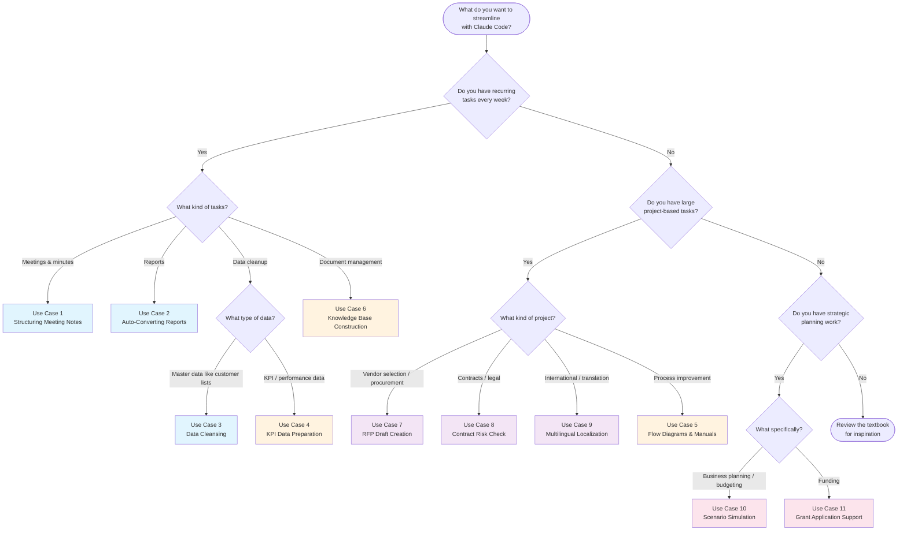

# Module 3: Advanced Use Cases — Reference Materials

## 1. Complete Use Case Overview

### Summary Matrix

| # | Use Case | Business Area | Frequency | Impact | Difficulty |
|---|----------|--------------|-----------|--------|------------|
| 1 | Structuring meeting notes | General | Daily-Weekly | ★★★ | ★☆☆ |
| 2 | Auto-converting standard reports | General | Weekly-Monthly | ★★★ | ★☆☆ |
| 3 | Data cleansing | Data management | As needed | ★★★ | ★★☆ |
| 4 | KPI/OKR dashboard data preparation | Corporate planning | Monthly | ★★★ | ★★☆ |
| 5 | Process flow diagrams & manuals | Process improvement | As needed | ★★★ | ★☆☆ |
| 6 | Internal knowledge base construction | General | As needed (large initial effort) | ★★★ | ★★☆ |
| 7 | RFP draft creation | Procurement / IT | Per project | ★★☆ | ★★☆ |
| 8 | Contract risk check assistance | Legal / Admin | Per project | ★★☆ | ★★★ |
| 9 | Multilingual content localization | Marketing / PR | As needed | ★★☆ | ★★☆ |
| 10 | Business plan scenario simulation | Corporate planning | Quarterly-Annual | ★★★ | ★★★ |
| 11 | Grant & subsidy application support | Corporate planning / Admin | A few times/year | ★★★ | ★★★ |

### Legend

- **Impact**: Effect on business efficiency (3 stars = highest)
- **Difficulty**: Level of Claude Code proficiency required (3 stars = most advanced)
- **Frequency**: Typical frequency of use

### Recommended Adoption Sequence

```
Phase 1 (Week 1)    : Use Cases 1, 2     <- Start here
Phase 2 (Weeks 2-3) : Use Cases 3, 5     <- Once you are comfortable
Phase 3 (Month 1)   : Use Cases 4, 6     <- Integrate into monthly tasks
Phase 4 (As needed) : Use Cases 7-11     <- As the need arises
```

---

## 2. Prompt Template Collection

Copy the templates below and replace the content in `[brackets]` with your own information.

---

### Template 1: Structuring Meeting Notes

```
Read [meeting notes file path] and structure the meeting minutes in the following format.

## Output Format
1. Meeting Minutes (Markdown format)
   - Meeting name, date, attendees
   - Summary by topic
   - Decisions (numbered list)
   - Action items (table with owner, task, deadline)

2. Action Item List (separate file)
   - Grouped by owner
   - Each item in GitHub Issue format (title, body, suggested labels)

Output:
- [output path]-structured.md (structured minutes)
- [output path]-actions.md (action items)

## Additional Notes
- For items without an explicit deadline, write "Deadline TBD"
- If it is unclear whether something is a decision or still under discussion, add a "needs confirmation" note
- [Add any other instructions here]
```

---

### Template 2: Auto-Converting Standard Reports

```
Read [detailed report file path] and generate the following versions.

## Summary Version ([output path]-summary.md)
- Target audience: [reader's role/department]
- Length: [approximately one page / 10 bullet points or fewer / etc.]
- Include: [items to include, comma-separated]
- Exclude: [items to exclude, comma-separated]
- Tone: [concise & fact-based / strategic / collaborative / positive / etc.]

## Additional Versions (add sections as needed)
(Same format as above)

## Notes
- Transfer numbers accurately from the original
- Always include [specific information]
- Never include [specific information]
```

---

### Template 3: Data Cleansing

```
Read [data file path] and perform data cleansing according to the following rules.

## Cleansing Rules

### [Column 1] Normalization
- [Describe conversion rules]

### [Column 2] Normalization
- [Describe conversion rules]

### Duplicate Detection
- [Describe duplicate detection criteria (e.g., similar company name + contact name)]
- Do not auto-merge; generate a report for human review

## Output
1. [output path]-cleaned.csv (cleansed data)
2. [output path]-report.md (change report)

## Notes
- Do not overwrite the original data
- Flag ambiguous changes as "needs confirmation"
- [Other rules]
```

---

### Template 4: KPI/OKR Dashboard Data Preparation

```
Read the files under [data directory path] and create unified KPI dashboard data.

## Data Sources
- [File 1]: [description]
- [File 2]: [description]
- [File 3]: [description]

## Unified Format Specification

### File: [output path]/kpi-summary.csv
Columns:
- Category
- KPI Name
- Target Value
- Actual Value
- Achievement Rate (%)
- Month-over-Month (%)
- Status (Achieved/On Track/At Risk/Below Target)

Status criteria:
- Achieved: Achievement rate >= 100%
- On Track: Achievement rate >= [threshold]%
- At Risk: Achievement rate >= [threshold]%
- Below Target: Achievement rate < [threshold]%

### File: [output path]/kpi-commentary.md
One-line summary per KPI plus recommended actions for at-risk items
```

---

### Template 5: Process Flow Diagrams & Manuals

```
Read [interview notes file path] and create the following deliverables.

## 1. Flowchart (Mermaid format)
- Include [main flow / sub-flows]
- Branching conditions: [describe conditions]
- Output: [output path]-flow.md

## 2. Procedure Manual
- Target audience: [new employees / team members / managers]
- Include "owner," "tools used," and "estimated time" for each step
- Include tips on common mistakes and things to watch out for
- Output: [output path]-manual.md

## 3. Open Questions List
- Organize unclear points as a question list
- Output: [output path]-questions.md
```

---

### Template 6: Internal Knowledge Base Construction

```
Read all files under [document directory path] and propose a structure
for the internal knowledge base.

## Requirements
- Target audience: [all employees / specific department / new hires]
- Propose a categorization scheme
- Create an article template
- Consolidate overlapping content
- Flag content that may be outdated

## Output
1. [output path]/README.md (table of contents and usage guide)
2. [output path]/template.md (article template)
3. [output path]/structure-proposal.md (proposed structure)
```

---

### Template 7: RFP Draft Creation

```
Create an RFP (Request for Proposal) draft based on the following requirements notes.

## Requirements Notes
- Purpose: [what to procure/replace/build]
- Current system: [current state and issues]
- Budget: [budget range]
- Go-live target: [target date]
- Number of users: [expected user count]
- Must-have requirements: [essential features/conditions]
- Nice-to-have: [desirable features/conditions]

## RFP Structure
1. Company overview and project background
2. Current system overview and issues
3. Requirements (functional and non-functional)
4. Items to include in proposals
5. Evaluation criteria (with scoring rubric)
6. Schedule
7. Proposal submission process
8. Contract terms

Output: [output path]

## Notes
- Assign priority levels (Must-have / Should-have / Nice-to-have) to each requirement
- Mark unclear items with a [TBD] tag
```

---

### Template 8: Contract Risk Check Assistance

```
Read [contract file path] and perform a risk check using the following checklist.

## Checklist
### Basic Terms
- [ ] Full legal names of contracting parties
- [ ] Contract period and renewal conditions
- [ ] Termination clause (notice period, penalties)

### Fees & Payment Terms
- [ ] Clarity of pricing structure
- [ ] Payment terms
- [ ] Price increase provisions

### Liability & Risk
- [ ] Cap on damages
- [ ] Confidentiality clause
- [ ] Personal data handling
- [ ] Intellectual property ownership

### Other
- [ ] Anti-corruption clause
- [ ] Force majeure clause
- [ ] Governing law and jurisdiction

## Output Format
For each item: relevant clause, risk level (High/Medium/Low), concerns, recommended action

Output: [output path]

* This check is a first-pass screening. Final decisions are made by the legal department.
```

---

### Template 9: Multilingual Content Localization

```
Localize the following file into [target language].

Source: [source file path]
Output: [output path]

## Translation Rules
1. Refer to the glossary ([glossary file path]) and use standardized terms
2. Use a [formal/casual/technical] tone appropriate for [content type]
3. Do not translate proper nouns (product names, company names)
4. Date and currency format: [specify format]
5. [Other translation rules]

## Additional Output
If there are terms to add to the glossary, output them as [path]
```

---

### Template 10: Scenario Simulation

```
Perform a profit/loss simulation for [number] scenarios based on the following assumptions.

## Business Overview
- Business: [description]
- Revenue model: [monthly subscription / one-time / usage-based / etc.]
- Current scale: [revenue / customers / etc.]

## Scenario Parameters

| Parameter | [Scenario 1 name] | [Scenario 2 name] | [Scenario 3 name] |
|-----------|-------------------|-------------------|-------------------|
| [Parameter 1] | [value] | [value] | [value] |
| [Parameter 2] | [value] | [value] | [value] |
| [Parameter 3] | [value] | [value] | [value] |

## Fixed Conditions (All Scenarios)
- [Fixed cost breakdown]

## Output
1. [output path]/scenario-comparison.csv -- Monthly P/L
2. [output path]/scenario-summary.md -- Annual summary
3. [output path]/sensitivity-analysis.md -- Sensitivity analysis
4. [output path]/break-even-analysis.md -- Break-even analysis

## Notes
- Show your calculations
- Note any assumptions explicitly
```

---

### Template 11: Grant & Subsidy Application Support

```
Read the following grant's call for proposals and help prepare the application.

## Target
Grant name: [grant name]
Guidelines file: [file path]

## Task 1: Requirements Summary
Organize eligibility, eligible expenses, subsidy rate/cap, schedule, required documents,
and evaluation criteria.
Output: [output path]-requirements.md

## Task 2: Eligibility Check
Our company:
- Industry: [industry]
- Employees: [count]
- Capitalization: [amount]
- Location: [location]
- Planned investment: [target equipment/tool/project]

Output: [output path]-eligibility.md

## Task 3: Application Draft
Create an application draft following the guidelines.
Mark sections needing company-specific information with [TO BE COMPLETED].
Output: [output path]-draft.md
```

---

## 3. Use Case Selection Flowchart

> **"Finding the right use case for you"**
>
> Follow the flow below to find the best use case to start with.



### Text Version of the Flowchart

For environments where Mermaid is not supported:

```
Which of the following best describes your situation?

A) I repeat similar tasks every week
   -> Meeting-related       -> Use Case 1 (Structuring Meeting Notes)
   -> Report-related        -> Use Case 2 (Auto-Converting Reports)
   -> Data cleanup          -> Use Case 3 (Data Cleansing)
                              or Use Case 4 (KPI Data Preparation)
   -> Document management   -> Use Case 6 (Knowledge Base Construction)

B) I have large project-based tasks
   -> Vendor selection      -> Use Case 7 (RFP Draft Creation)
   -> Contracts / legal     -> Use Case 8 (Contract Risk Check)
   -> International         -> Use Case 9 (Multilingual Localization)
   -> Process improvement   -> Use Case 5 (Flow Diagrams & Manuals)

C) I am working on strategic planning
   -> Business planning     -> Use Case 10 (Scenario Simulation)
   -> Funding               -> Use Case 11 (Grant Application Support)
```

---

## 4. Important Notes & Considerations

### Security & Privacy

| Category | Note | Applicable Use Cases |
|----------|------|---------------------|
| **Personal data** | Mask or anonymize customer names, contact details, and addresses per your organization's policy before processing | 1, 3, 4, 6 |
| **Confidential information** | Be careful with financial figures, unreleased business plans, and contract terms | 2, 7, 8, 10, 11 |
| **Credentials** | Never include API keys, passwords, or access tokens in prompts or files | All |
| **Third-party information** | Do not include non-public information about partners or competitors | 7, 8, 9 |

### Data Accuracy

| Category | Note | Applicable Use Cases |
|----------|------|---------------------|
| **Verify numbers** | Always cross-check dollar amounts, percentages, and dates against the original source | 2, 3, 4, 10 |
| **Verify calculations** | Spot-check simulation results by hand | 10, 11 |
| **Fact-check** | Confirm that "facts" stated by Claude Code actually exist in the source data | All |
| **Hallucinations** | Claude Code may "infer" information not present in the source data. Pay special attention to proper nouns | All |

### Legal & Compliance

| Category | Note | Applicable Use Cases |
|----------|------|---------------------|
| **Legal validity** | AI-generated contracts, RFPs, and applications have no legal standing. Always have them reviewed by a specialist | 7, 8, 11 |
| **Disclaimer** | Legal assessments (e.g., contract risk evaluation) from AI are advisory; final decisions must be made by humans | 8 |
| **Truthfulness** | Grant application content must be factual. Do not submit AI-generated text as-is | 11 |
| **Intellectual property** | Verify copyright and licensing for content being translated | 9 |

### Operational Notes

| Category | Note | Applicable Use Cases |
|----------|------|---------------------|
| **Backups** | Back up original data before cleansing or transformation | 3, 4, 6 |
| **Incremental approach** | For large datasets, verify quality on a sample before processing the full set | 3, 4, 9 |
| **Version control** | Use Git for documents that will be continuously updated (manuals, knowledge base) | 5, 6 |
| **Regular reviews** | Periodically review and update reusable templates and prompts | All |
| **Human review** | Always have a human review AI output before final use, especially for externally shared documents | All |

### The Most Important Principle: AI Output Is a "Draft"

The single most important principle across all use cases is that **Claude Code's output is always a "draft," never the final version**.

- Meeting minutes -> Have attendees verify
- Reports -> Cross-check numbers against the original
- Data cleansing -> Visually review the change report
- Flow diagrams -> Have the actual process owners review
- RFPs & contracts -> Have legal/specialists review
- Simulations -> Verify assumptions and calculations
- Applications -> Fact-check and have specialists review

By viewing AI not as a "perfect assistant" but as a "talented drafter whose work needs verification," you can use it safely and effectively.
