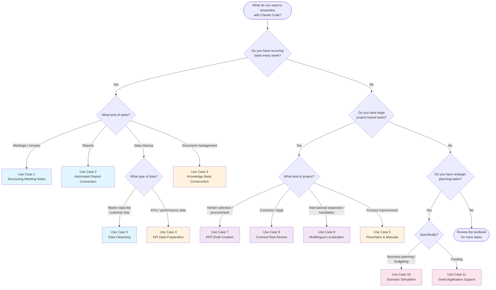

# Module 3: Advanced Use Cases — Reference Materials

## 1. Complete Use Case List

### Overview Matrix

| # | Use Case | Business Area | Frequency | Impact | Difficulty |
|---|----------|--------------|-----------|--------|------------|
| 1 | Structuring meeting notes | General | Daily to weekly | 3/3 | 1/3 |
| 2 | Automated report conversion | General | Weekly to monthly | 3/3 | 1/3 |
| 3 | Data cleansing | Data management | As needed | 3/3 | 2/3 |
| 4 | KPI/OKR dashboard data preparation | Business planning | Monthly | 3/3 | 2/3 |
| 5 | Business process flowcharts and manuals | Process improvement | As needed | 3/3 | 1/3 |
| 6 | Building and updating an internal knowledge base | General | As needed (large initial effort) | 3/3 | 2/3 |
| 7 | RFP draft creation | Procurement / IT | Per project | 2/3 | 2/3 |
| 8 | Contract and terms-of-service risk review | Legal / Admin | Per project | 2/3 | 3/3 |
| 9 | Multilingual content localization | Marketing / PR | As needed | 2/3 | 2/3 |
| 10 | Business plan scenario simulation | Business planning | Quarterly to annually | 3/3 | 3/3 |
| 11 | Grant and subsidy application support | Business planning / Admin | A few times per year | 3/3 | 3/3 |

### Legend

- **Impact**: How much it improves business efficiency (3/3 = highest)
- **Difficulty**: Level of Claude Code proficiency required (3/3 = most advanced)
- **Frequency**: Typical frequency of use

### Recommended Adoption Sequence

```
Phase 1 (Week 1)    : Use Cases 1, 2       <- Start here
Phase 2 (Weeks 2-3) : Use Cases 3, 5       <- Once comfortable
Phase 3 (Month 1)   : Use Cases 4, 6       <- Integrate into monthly workflows
Phase 4 (As needed) : Use Cases 7-11       <- As the need arises
```

---

## 2. Prompt Template Collection

Copy the templates below and replace the content in `[brackets]` with your own information.

---

### Template 1: Structuring Meeting Notes

```
Read [file path to meeting notes] and structure the minutes in the following format.

## Output Format
1. Meeting minutes (Markdown)
   - Meeting name, date/time, attendees
   - Summary for each agenda item
   - Decisions (numbered list)
   - Action items (table with owner, description, deadline)

2. Action item list (separate file)
   - Grouped by owner
   - Each item in GitHub Issue format (title, body, suggested labels)

Output to:
- [output path]-structured.md (structured minutes)
- [output path]-actions.md (action items)

## Additional Notes
- For items without an explicit deadline, note "deadline TBD"
- If it's unclear whether something is a decision or still under discussion, add "needs confirmation"
- [Add any other instructions]
```

---

### Template 2: Automated Report Conversion

```
Read [file path to detailed report] and generate the following version(s).

## Summary version ([output path]-summary.md)
- Target audience: [role/department of reader]
- Length: [~1 A4 page / 10 bullet points or fewer / etc.]
- Include: [items to include, comma-separated]
- Exclude: [items to exclude, comma-separated]
- Tone: [concise & fact-based / strategic / collaborative / positive / etc.]

## Additional version (add sections as needed)
(Same format as above)

## Notes
- Transfer numerical values accurately from the original
- Always include [specific information]
- Never include [specific information]
```

---

### Template 3: Data Cleansing

```
Read [file path to data file] and perform data cleansing according to the following rules.

## Cleansing Rules

### [Column 1] normalization
- [Describe the transformation rules]

### [Column 2] normalization
- [Describe the transformation rules]

### Duplicate detection
- [Describe the criteria for identifying duplicates (e.g., records with similar company name + contact name)]
- Do not auto-merge; generate a report for human review

## Output
1. [output path]-cleaned.csv (cleansed data)
2. [output path]-report.md (report of changes)

## Notes
- Do not overwrite the original data
- Flag any ambiguous changes as "needs review"
- [Any other rules]
```

---

### Template 4: KPI/OKR Dashboard Data Preparation

```
Read the files under [data directory path] and
create unified KPI dashboard data.

## Data Sources
- [File 1]: [description of contents]
- [File 2]: [description of contents]
- [File 3]: [description of contents]

## Unified Format Specification

### File: [output path]/kpi-summary.csv
Columns:
- Category
- KPI Name
- Target Value
- Actual Value
- Achievement Rate (%)
- Month-over-Month Change (%)
- Status (Achieved / On Track / Needs Attention / Missed)

Status criteria:
- Achieved: Achievement Rate >= 100%
- On Track: Achievement Rate >= [threshold]%
- Needs Attention: Achievement Rate >= [threshold]%
- Missed: Achievement Rate < [threshold]%

### File: [output path]/kpi-commentary.md
One-line summary per KPI, plus recommended actions for items needing attention
```

---

### Template 5: Business Process Flowchart and Manual

```
Read [file path to interview notes] and create the following deliverables.

## 1. Flowchart (Mermaid format)
- Include [main flow / sub-flows]
- Branching conditions: [describe branching conditions]
- Output to: [output path]-flow.md

## 2. Procedure manual
- Target audience: [new employees / team members / managers]
- Each step should include "responsible party," "tool used," and "estimated time"
- Include tips with common pitfalls and mistakes
- Output to: [output path]-manual.md

## 3. Open questions list
- Organize any unclear points as a question list
- Output to: [output path]-questions.md
```

---

### Template 6: Building and Updating an Internal Knowledge Base

```
Read all files under [document directory path] and
propose a structure for our internal knowledge base.

## Requirements
- Target audience: [all employees / specific department / new hires]
- Propose a categorization scheme
- Create a unified article template
- Consolidate overlapping content
- Flag content that may be outdated

## Output
1. [output path]/README.md (table of contents and usage guide)
2. [output path]/template.md (article template)
3. [output path]/structure-proposal.md (proposed structure)
```

---

### Template 7: RFP Draft Creation

```
Based on the following requirements notes, create an RFP (Request for Proposal) draft.

## Requirements Notes
- Purpose: [what is being introduced / replaced / built]
- Current system: [overview and issues with current state]
- Budget: [budget range]
- Go-live target: [target date for production use]
- Number of users: [expected user count]
- Must-have requirements: [essential features/conditions]
- Nice-to-have: [desirable features/conditions]

## RFP Structure
1. Company overview and project background
2. Current system overview and issues
3. Requirements for the new system (functional and non-functional)
4. Items to include in the proposal
5. Evaluation criteria (with scoring rubric)
6. Schedule
7. Proposal submission procedures
8. Contract terms

Output to: [output path]

## Notes
- Assign priority to requirements (Must-have / Should-have / Nice-to-have)
- Mark unclear items with a [TBD] tag
```

---

### Template 8: Contract and Terms-of-Service Risk Review

```
Read [file path to contract] and perform a risk review
based on the following checklist.

## Checklist
### Basic Terms
- [ ] Full legal names of contracting parties
- [ ] Contract period and renewal conditions
- [ ] Termination clause (notice period, penalties)

### Fees and Payment Terms
- [ ] Clarity of pricing structure
- [ ] Payment terms (net days)
- [ ] Price increase provisions

### Liability and Risk
- [ ] Liability cap / limitation of damages
- [ ] Confidentiality clause
- [ ] Data protection and privacy
- [ ] Intellectual property ownership

### Other
- [ ] Anti-corruption / compliance clause
- [ ] Force majeure clause
- [ ] Governing law and jurisdiction

## Output Format
For each item: relevant section, risk level (High / Medium / Low), concerns, recommended action

Output to: [output path]

* This review is a first-pass screening. Final decisions are made by the legal department.
```

---

### Template 9: Multilingual Content Localization

```
Localize the following file into [target language].

Source file: [source file path]
Output to: [output path]

## Translation Rules
1. Reference the glossary ([glossary file path]) and use approved translations
2. Use a [formal / casual / technical] tone appropriate for [content type]
3. Do not translate proper nouns (product names, company names)
4. Date and currency format: [specify format]
5. [Any other translation rules]

## Additional Output
If any terms should be added to the glossary, output them as [path]
```

---

### Template 10: Scenario Simulation

```
Based on the following assumptions, run a [number]-scenario P&L simulation.

## Business Overview
- Business type: [overview]
- Revenue model: [subscription / one-time / usage-based / etc.]
- Current scale: [revenue / customer count / etc.]

## Scenario Parameters

| Parameter | [Scenario 1 name] | [Scenario 2 name] | [Scenario 3 name] |
|-----------|-------------------|-------------------|-------------------|
| [Parameter 1] | [value] | [value] | [value] |
| [Parameter 2] | [value] | [value] | [value] |
| [Parameter 3] | [value] | [value] | [value] |

## Fixed Conditions (all scenarios)
- [Fixed cost breakdown]

## Output
1. [output path]/scenario-comparison.csv — Monthly P&L
2. [output path]/scenario-summary.md — Annual summary
3. [output path]/sensitivity-analysis.md — Sensitivity analysis
4. [output path]/break-even-analysis.md — Break-even analysis

## Notes
- Show calculation steps
- Clearly note any assumptions you made
```

---

### Template 11: Grant and Subsidy Application Support

```
Read the following grant guidelines and help prepare the application.

## Target
Grant name: [grant name]
Guidelines file: [file path]

## Task 1: Requirements Summary
Organize the eligibility criteria, eligible expenses, funding rate and cap,
schedule, required documents, and evaluation criteria.
Output to: [output path]-requirements.md

## Task 2: Eligibility Check
Our company information:
- Industry: [industry]
- Employees: [count]
- Revenue/capital: [amount]
- Location: [location]
- Planned investment: [target equipment/tool/initiative]

Output to: [output path]-eligibility.md

## Task 3: Application Draft
Create an application draft following the guidelines' requirements.
Mark company-specific information to be filled in with [TO BE COMPLETED] tags.
Output to: [output path]-draft.md
```

---

## 3. Use Case Selection Flowchart

> **"How to find the right use case for you"**
>
> Follow the flow below to identify the best use case to start with.



### Text Version of the Flowchart

For environments where Mermaid doesn't render:

```
Which situation best describes you?

A) I repeat similar tasks every week
   -> Meeting-related          -> Use Case 1 (Structuring Meeting Notes)
   -> Report-related           -> Use Case 2 (Automated Report Conversion)
   -> Data cleanup             -> Use Case 3 (Data Cleansing)
                                  or Use Case 4 (KPI Data Preparation)
   -> Document management      -> Use Case 6 (Knowledge Base Construction)

B) I have large project-based tasks
   -> Vendor selection         -> Use Case 7 (RFP Draft)
   -> Contracts / legal        -> Use Case 8 (Contract Risk Review)
   -> International expansion  -> Use Case 9 (Multilingual Localization)
   -> Process improvement      -> Use Case 5 (Flowcharts & Manuals)

C) I'm doing strategic planning
   -> Business planning        -> Use Case 10 (Scenario Simulation)
   -> Funding                  -> Use Case 11 (Grant Application Support)
```

---

## 4. Important Considerations

### Security and Privacy

| Category | Consideration | Applicable Use Cases |
|----------|--------------|---------------------|
| **Personal data** | Mask or anonymize personal information (names, contact details, addresses, etc.) in accordance with your organization's policies before processing | 1, 3, 4, 6 |
| **Confidential information** | Exercise caution with financial figures, unreleased business plans, and contract terms that are not for external disclosure | 2, 7, 8, 10, 11 |
| **Credentials** | Never include API keys, passwords, or access tokens in prompts or files | All |
| **Third-party information** | Do not include non-public information about partners or competitors' internal data | 7, 8, 9 |

### Data Accuracy

| Category | Consideration | Applicable Use Cases |
|----------|--------------|---------------------|
| **Numerical verification** | Always cross-check monetary amounts, percentages, and dates against the original source | 2, 3, 4, 10 |
| **Calculation verification** | Spot-check simulation results with manual calculations | 10, 11 |
| **Fact-checking** | Verify that any "facts" generated by Claude Code actually exist in the source data | All |
| **Hallucination** | Claude Code may "infer" information not present in the source data. Pay special attention to proper nouns | All |

### Legal and Compliance

| Category | Consideration | Applicable Use Cases |
|----------|--------------|---------------------|
| **Legal validity** | AI-generated contracts, RFPs, and applications have no legal standing. Always have them reviewed by a professional | 7, 8, 11 |
| **Disclaimer** | Legal judgments (such as contract risk assessments) from AI are advisory only; final decisions must be made by a human | 8 |
| **False statements** | Grant application content must be factual. Never submit AI-generated text without verification | 11 |
| **Intellectual property** | Verify the copyright and licensing status of content being translated | 9 |

### Operational Considerations

| Category | Consideration | Applicable Use Cases |
|----------|--------------|---------------------|
| **Backup** | Always back up original data before cleansing or conversion | 3, 4, 6 |
| **Phased rollout** | For large datasets, validate quality on a sample first before processing the full set | 3, 4, 9 |
| **Version control** | Manage continuously updated documents (manuals, knowledge bases) with Git | 5, 6 |
| **Regular review** | Periodically revisit templates and prompts you use repeatedly | All |
| **Human review** | Always have a human review AI output before final use — especially for externally shared documents | All |

### The Most Important Principle: AI Output Is a "Draft"

The single most important principle across all use cases is that **Claude Code's output is always a "draft" — never the final version**.

- Meeting minutes -> Have attendees verify them
- Reports -> Cross-check numbers against the original
- Data cleansing -> Review the change report visually
- Flowcharts -> Have the actual process owners review them
- RFPs and contracts -> Get legal/professional review
- Simulations -> Verify assumptions and calculation results
- Applications -> Fact-check and get professional review

By treating AI not as a "perfect assistant" but as a "capable drafter whose work needs review," you can use it safely and effectively.
