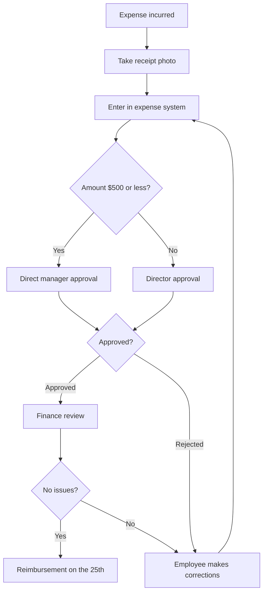

# Module 3: Advanced Use Cases — Expanding the Scope of AI Agent Utilization

## Introduction

### Recap of Modules 1 and 2

In Module 1, you learned the basics of Claude Code: launching the terminal, entering prompts, and reading and writing files.

In Module 2, you developed three practical skills:

- **Research**: Gathering and organizing information from the web and internal documents
- **Document creation**: Creating structured documents in Markdown
- **Data analysis**: Loading CSV files for aggregation and visualization

### Where This Module Fits

In Module 3, we combine the skills you have learned so far and introduce **11 use cases that deliver immediate value in real-world business settings**.

You already understand what Claude Code can do. Now the goal is to **discover where it fits in your own work** — and put it into practice.

### How to Study This Module

| Part | Theme | Detail Level | Estimated Time |
|------|-------|-------------|----------------|
| Part 1 | Streamlining daily tasks | Detailed (step-by-step) | 60 min |
| Part 2 | Automating recurring tasks | Detailed (step-by-step) | 60 min |
| Part 3 | Project-based applications | Overview + prompt examples | 30 min |
| Part 4 | Strategic applications | Overview + prompt examples | 20 min |

We recommend that everyone work through Parts 1 and 2. For Parts 3 and 4, choose the use cases that are most relevant to your work.

---

## Part 1: Streamlining Daily Tasks

> **Use cases covered**: Structuring meeting notes / Automated report conversion / Data cleansing
>
> These are use cases that deliver immediate results for tasks that occur daily or weekly.

---

### Use Case 1: Structuring Meeting Notes

#### What Business Problem Does This Solve?

Have you ever experienced any of the following after a meeting?

- You took notes, but later wonder, "So what was actually decided?"
- Action items are vague, with unclear owners or deadlines
- Meeting notes are scattered across chat messages and notepads, making them hard to trace later

In this use case, you hand **rough meeting notes** to Claude Code, which will automatically:

1. Generate structured meeting minutes
2. Extract decisions and action items
3. Convert them into a format ready to be filed as GitHub Issues

#### Step-by-Step Workflow

```
[What you need]
- Meeting notes (a text file or copy-pasteable text)
- A GitHub repository (if you want to create Issues)
```

**Step 1: Save the meeting notes as a file**

First, save your meeting notes as a text file. If you have handwritten notes, type them up roughly. They don't need to be perfect.

Example file: `meeting-notes/2026-03-11-weekly.txt`

```
Weekly standup 3/11
Attendees: Tanaka, Sato, Suzuki, Takahashi

- Q1 revenue progress -> 85% achieved; remaining 15% achievable with 2 enterprise deals
- New feature release moved to 3/25 (originally 3/18) -> QA is behind schedule
- Sato to compile Client A's request list (by 3/14)
- Hiring: interviews for 2 engineers next week; Tanaka to schedule
- Revisit marketing budget reallocation next meeting; Takahashi to prepare a proposal
- From Suzuki: Competitor B announced a new plan; need to create a pricing comparison table
```

**Step 2: Ask Claude Code to structure the notes**

Enter a prompt like the following:

```
Read meeting-notes/2026-03-11-weekly.txt and structure it in the following format.

## Output format
1. Meeting minutes (Markdown)
   - Meeting name, date, attendees
   - Summary for each agenda item
   - Decisions (numbered list)
   - Action items (table with owner, description, deadline)

2. Action item list (separate file)
   - Grouped by owner
   - Each item in GitHub Issue format (title, body, suggested labels)

Output to:
- meeting-notes/2026-03-11-weekly-structured.md (structured minutes)
- meeting-notes/2026-03-11-weekly-actions.md (action items)
```

**Step 3: Review the output**

Check the files Claude Code generated. The structured minutes should look roughly like this:

```markdown
# Weekly Standup Meeting Minutes

- **Date**: March 11, 2026
- **Attendees**: Tanaka, Sato, Suzuki, Takahashi

## Agenda and Discussion

### 1. Q1 Revenue Progress
- Current achievement rate: 85%
- Outlook for remaining 15%: achievable with 2 enterprise deals

### 2. New Feature Release Schedule
- Release date changed from 3/18 to **3/25**
- Reason: delay in QA process

(continued...)

## Decisions
1. New feature release date changed to March 25
2. Q1 revenue target to be met through 2 enterprise deals

## Action Items

| # | Owner | Description | Deadline |
|---|-------|-------------|----------|
| 1 | Sato | Compile Client A's request list | 3/14 |
| 2 | Tanaka | Schedule engineer interviews | Within next week |
| 3 | Takahashi | Prepare marketing budget reallocation proposal | Before next standup |
| 4 | Suzuki | Create pricing comparison table vs. Competitor B | TBD |
```

**Step 4: File as GitHub Issues (optional)**

If you want to file the action items as GitHub Issues, enter the following prompt:

```
File the action items from meeting-notes/2026-03-11-weekly-actions.md
as GitHub Issues.

Repository: our-team/project-tasks
Label: add "meeting-action" to all issues
Owner GitHub accounts:
  Tanaka -> tanaka
  Sato -> sato
  Suzuki -> suzuki
  Takahashi -> takahashi
```

#### Expected Deliverables

| Deliverable | Format | Purpose |
|-------------|--------|---------|
| Structured minutes | Markdown file | Sharing and archiving |
| Action item list | Markdown file | Starting point for task management |
| GitHub Issues (multiple) | Issues | Actual task tracking |

#### Notes and Limitations

- **Watch out for confidential information**: If meeting notes contain personal data or sensitive information, mask those sections before passing them to Claude Code
- **Provide context when needed**: If abbreviations or internal jargon are common, include a glossary with the prompt to improve accuracy
- **Judgment on decisions**: Claude Code infers decisions from keywords like "changed to" or "decided on," but always have a human do the final review
- **Verify before filing Issues**: Always confirm the action items and owners before automatically creating Issues

---

### Use Case 2: Automated Report Conversion

#### What Business Problem Does This Solve?

In business, the same data often needs to be reported at different levels of detail and in different formats:

- **Detailed version**: A comprehensive report with all data, for your own team
- **Summary version**: A condensed report highlighting key points, for your manager
- **Shared version**: A visually oriented document for executives or other departments

Manually creating these variations from a single detailed report is a significant burden. With Claude Code, you can auto-generate multiple versions from a single prompt.

#### Step-by-Step Workflow

**Step 1: Prepare the detailed report**

Start with the most information-rich "detailed version." This will serve as the source for conversion.

Example file: `reports/monthly/2026-02-detail.md`

```markdown
# February 2026 Sales Department Monthly Report (Detailed)

## 1. Revenue Results

### 1.1 Overall Summary
- Total revenue: 48.5M JPY (103% of target)
- New customer revenue: 12M JPY (24.7% of total)
- Existing customer revenue: 36.5M JPY (75.3% of total)

### 1.2 By Segment
| Segment | Revenue | Month-over-Month | vs. Target |
|---------|---------|-----------------|------------|
| Enterprise | 21M JPY | +12% | 110% |
| SMB | 18M JPY | -3% | 95% |
| Startup | 9.5M JPY | +8% | 105% |

### 1.3 Deal-Level Details
(Detailed data for 20 individual deals...)

## 2. Pipeline Status
(Detailed opportunity list...)

## 3. Team KPIs
(Individual performance data...)

## 4. Issues and Countermeasures
(Detailed issue analysis...)
```

**Step 2: Specify the conversion rules and submit the request**

```
Read reports/monthly/2026-02-detail.md and generate the following 3 versions.

## 1. Summary version (reports/monthly/2026-02-summary.md)
- Target audience: Department manager
- Length: roughly 1 page (A4)
- Include: overall revenue results, target achievement status, top 3 issues, next month's actions
- Exclude: deal-level details, individual KPIs
- Tone: concise, fact-based

## 2. Executive version (reports/monthly/2026-02-executive.md)
- Target audience: C-suite / senior leadership
- Length: no more than 10 bullet points
- Include: headline revenue figures, month-over-month trends, key risks and opportunities
- Structure: 3 sections — "Key Highlights," "Risks & Opportunities," "Next Steps"
- Tone: strategic perspective, only information needed for decision-making

## 3. Cross-team version (reports/monthly/2026-02-crossteam.md)
- Target audience: Marketing and Product teams
- Include: customer feedback trends, segment-level dynamics, items requiring cross-team collaboration
- Exclude: specific monetary amounts, individual names
- Tone: collaborative, requesting cooperation
```

**Step 3: Review and adjust each version**

Review the three generated files and request modifications as needed.

```
I've reviewed reports/monthly/2026-02-executive.md.
Please make the following adjustments:
- Instead of "strong revenue," put the specific number (103% of target) in the headline
- Add "SMB segment month-over-month decline" to the Risks section
```

#### Expected Deliverables

From the original detailed report (roughly 5 A4 pages), the following 3 files are auto-generated:

| Version | Length | Primary Audience |
|---------|--------|-----------------|
| Summary | ~1 A4 page | Department manager |
| Executive | 10 bullet points | C-suite / senior leadership |
| Cross-team | ~1 A4 page | Marketing & Product teams |

#### Notes and Limitations

- **Always verify numerical accuracy**: Numbers may be rounded or inadvertently changed during conversion. Always cross-check amounts and percentages against the original
- **Adjust the tone**: How strongly to emphasize "issues" depends on organizational culture and the current situation. Always review with a human eye after auto-generation
- **Manage confidentiality levels**: Verify that the cross-team version doesn't contain information that shouldn't be shared
- **Create templates**: If you run the same conversion every month, save the prompt as a text file for reuse

---

### Use Case 3: Data Cleansing

#### What Business Problem Does This Solve?

Over time, data in customer lists, vendor master files, and product catalogs accumulates problems like:

- **Inconsistent naming**: "ABC Inc.," "ABC Corporation," and "ABC Co." coexisting
- **Duplicate records**: The same person registered multiple times under different spellings
- **Missing values**: Phone numbers or email addresses partially blank
- **Inconsistent formats**: Dates appearing as "2026/3/11," "2026-03-11," and "March 11" interchangeably

Fixing these issues manually takes enormous amounts of time. With Claude Code, you can apply rule-based corrections in bulk.

#### Step-by-Step Workflow

**Step 1: Prepare the data to be cleansed**

Prepare your data as a CSV or TSV file.

Example file: `data/customer-list-raw.csv`

```csv
company_name,contact_name,phone,email,address,registration_date
ABC Inc,John Smith,212-555-1234,jsmith@abc.com,123 Main St New York NY,2025/4/1
ABC Corporation,John  Smith,2125551234,jsmith@abc.com,123 Main St New York NY,2025-04-01
ABC Co.,Jane Doe,,jdoe@abc.com,,2025.4.15
Design Works LLC,Bob Johnson,312-555-9876,bjohnson@dw.com,456 Oak Ave Chicago IL,03/01/2025
DesignWorks LLC,Bob  Johnson,3125559876,,456 Oak Ave  Chicago IL,2025/03/01
```

**Step 2: Define cleansing rules and submit the request**

```
Read data/customer-list-raw.csv and perform data cleansing according to the following rules.

## Cleansing Rules

### Company name normalization
- Standardize variations (e.g., "ABC Inc," "ABC Corporation," "ABC Co.") to a single canonical form
- Flag cases where a trade name and legal name likely refer to the same entity

### Contact name
- Normalize spacing between first and last names (single space)
- Standardize full-width/half-width characters

### Phone number
- Standardize to hyphenated format (e.g., 212-555-1234)
- Flag numbers with obviously incorrect digit counts

### Email address
- Flag blank entries
- Perform basic format validation

### Date
- Standardize all dates to YYYY-MM-DD format

### Duplicate detection
- List records with similar company name + contact name as duplicate candidates
- Do not auto-merge; generate a report for human review

## Output
1. data/customer-list-cleaned.csv (cleansed data)
2. data/cleaning-report.md (report of changes: what was changed and how, plus items needing review)
```

**Step 3: Review the cleansing report**

Claude Code generates both the cleansed data and a change report.

Expected report content:

```markdown
# Data Cleansing Report

## Processing Summary
- Records processed: 5
- Records with changes: 5
- Duplicate candidates: 2 groups

## Changes Made

### Company name normalization
| Row | Before | After |
|-----|--------|-------|
| 1 | ABC Inc | ABC Corporation |
| 3 | ABC Co. | ABC Corporation (needs review) |
(etc.)

## Duplicate Candidates

### Candidate 1: ABC Corporation / John Smith
- Row 1: ABC Corporation, John Smith, registered 2025-04-01
- Row 2: ABC Corporation, John Smith, registered 2025-04-01
- **Assessment**: Likely the same person (needs review)

## Items Needing Review
1. Is "ABC Co." (Row 3) the same entity as "ABC Corporation"?
2. Row 3: email domain matches (abc.com), suggesting the same entity
3. Row 5: extra space in address normalized — please verify
```

**Step 4: Incorporate review results**

After reviewing the flagged items, finalize the data.

```
Here are my responses to the review items in cleaning-report.md:

1. Yes, "ABC Co." is an informal name for "ABC Corporation." Standardize to "ABC Corporation."
2. Correct, same entity
3. That's fine

Please update the final customer-list-cleaned.csv with these responses.
Merge duplicate candidate 1 (keep Row 1, remove Row 2).
```

#### Expected Deliverables

| Deliverable | Format | Content |
|-------------|--------|---------|
| Cleansed data | CSV | Standardized naming and duplicates removed |
| Cleansing report | Markdown | Change log and items needing review |

#### Notes and Limitations

- **Back up your original data**: Always save a copy of the data before cleansing. Never overwrite the original
- **Be cautious with auto-merging**: Always have a human decide on duplicate merges. There's a risk of merging records for different people who happen to share the same name
- **Large datasets**: For files with more than a few thousand rows, processing may take a while. We recommend validating rules on a sample of about 100 rows first, then applying to the full dataset
- **Handling personal information**: When dealing with names, contact details, and other personal data, follow your organization's data handling policies

---

## Part 2: Automating Recurring Tasks

> **Use cases covered**: KPI/OKR dashboard data preparation / Business process flowcharts and manuals / Building and updating an internal knowledge base
>
> These are use cases for streamlining tasks that occur monthly or quarterly.

---

### Use Case 4: KPI/OKR Dashboard Data Preparation

#### What Business Problem Does This Solve?

In many organizations, KPI and OKR progress data is scattered across multiple sources:

- Revenue data in Spreadsheet A
- Customer satisfaction scores in Survey Tool B
- Development progress in GitHub Issues
- Marketing KPIs in Google Analytics reports

Every time the dashboard needs updating, manually aggregating and formatting this data is a major effort. With Claude Code, you can convert data in disparate formats into a unified format.

#### Step-by-Step Workflow

**Step 1: Prepare data from each source as files**

Export the data needed for the dashboard as CSV or Markdown files.

```
dashboard-data/
├── sales-202602.csv          # Revenue data (exported from spreadsheet)
├── csat-202602.csv           # Customer satisfaction (exported from survey tool)
├── dev-progress-202602.md    # Development progress (manually recorded notes)
└── marketing-kpi-202602.csv  # Marketing KPIs (exported from GA)
```

**Step 2: Request conversion to a unified format**

```
Read the 4 files under dashboard-data/ and create unified KPI dashboard data.

## Unified Format Specification

### File: dashboard-data/kpi-summary-202602.csv
Columns:
- Category (Revenue / Customer Satisfaction / Development / Marketing)
- KPI Name
- Target Value
- Actual Value
- Achievement Rate (%)
- Month-over-Month Change (%)
- Status (Achieved / On Track / Needs Attention / Missed)

Status criteria:
- Achieved: Achievement Rate >= 100%
- On Track: Achievement Rate >= 80%
- Needs Attention: Achievement Rate >= 60%
- Missed: Achievement Rate < 60%

### File: dashboard-data/kpi-commentary-202602.md
For each KPI:
- One-line numerical summary
- Notable points (if any)
- Recommended actions (only for "Needs Attention" or "Missed" items)

## Notes
- Each file has a different format, so interpret them appropriately
- dev-progress-202602.md is free-form text; extract relevant KPIs (e.g., releases, bugs)
- For items where no data is available, mark as "N/A" and note "data collection required" in the commentary
```

**Step 3: Generate dashboard visuals (optional)**

You can also generate a text-based dashboard.

```
Based on kpi-summary-202602.csv, create a text dashboard with the following format.

Format: Markdown
Content:
- Overall achievement summary (ASCII-art style bar chart)
- Detailed tables by category
- Highlights for KPIs needing attention

Output to: dashboard-data/dashboard-202602.md
```

#### Expected Deliverables

| Deliverable | Format | Purpose |
|-------------|--------|---------|
| Unified KPI data | CSV | Import into dashboard tool |
| KPI commentary | Markdown | Supplementary material for leadership meetings |
| Text dashboard | Markdown | Sharing via Slack or similar channels |

#### Notes and Limitations

- **Verify data interpretation**: Especially when extracting KPIs from free-form text, confirm that the interpretation is correct
- **Make it a monthly routine**: If you run the same process every month, save the prompt as a template file and change only the date portion
- **Source data quality**: The "Garbage In, Garbage Out" principle still applies. Errors in the source data will carry through to the consolidated output

---

### Use Case 5: Business Process Flowcharts and Manuals

#### What Business Problem Does This Solve?

Business processes often exist only in someone's head or in fragmentary notes. Many organizations face challenges like:

- When the person in charge is absent, nobody can run the process
- New team members require the same explanation every time
- Improvement efforts stall because the current state isn't documented

With Claude Code, you can auto-generate **Mermaid flowcharts** and **step-by-step procedure manuals** from interview notes or verbal descriptions.

#### Step-by-Step Workflow

**Step 1: Gather information about the business process**

Compile interview notes, existing manual fragments, and chat threads into a text file.

Example file: `process-docs/expense-claim-notes.txt`

```
Expense reimbursement process (from interview with Sato)

- When an employee incurs an expense, first take a photo of the receipt
- Enter it into the expense system (e.g., Expensify)
- If the amount is $500 or less, the direct manager approves
- Over $500 requires director-level approval
- After director approval, Finance reviews
- If no issues, reimbursement is paid on the 25th of the following month
- If rejected, a correction request goes back to the employee
- After correction, it goes through manager approval again
- Monthly cutoff; claims must be submitted by the 10th of the following month, or they roll over
- Transportation has a separate flow (commuting passes through HR, business travel through expense claims)
```

**Step 2: Request flowchart and manual generation**

```
Read process-docs/expense-claim-notes.txt and create the following deliverables.

## 1. Flowchart (Mermaid format)
- Main flow (standard expense reimbursement)
- Clearly show branching conditions ($500 or less / over $500, approved / rejected)
- Output to: process-docs/expense-claim-flow.md

## 2. Procedure manual
- Target audience: new employees
- Written step-by-step
- Each step should include "responsible party," "tool used," and "estimated time"
- Include tips with common pitfalls and mistakes
- Output to: process-docs/expense-claim-manual.md

## 3. Open questions list
- Organize any unclear points from the interview notes as a question list
- Output to: process-docs/expense-claim-questions.md
```

**Step 3: Preview the flowchart**

Mermaid flowcharts can be previewed directly on GitHub. Review the generated file.

Example of expected Mermaid code:

````markdown

````

**Step 4: Resolve open questions and update**

Once you have answers to the open questions, update the manual.

```
Here are my answers to the questions in process-docs/expense-claim-questions.md:

Q1: What currency should international business travel expenses be submitted in?
-> Submit in local currency equivalent. Use the exchange rate from the expense system on the transaction date.

Q2: What happens if a receipt is lost?
-> The employee creates a payment attestation form and gets their manager's signature.

Please incorporate these answers and update expense-claim-manual.md.
```

#### Expected Deliverables

| Deliverable | Format | Purpose |
|-------------|--------|---------|
| Flowchart | Mermaid-notation Markdown | Process visualization and sharing |
| Procedure manual | Markdown | Onboarding and knowledge transfer |
| Open questions list | Markdown | Supplementing interview information |

#### Notes and Limitations

- **Field verification is essential**: Always have the actual process owners review the generated flowcharts and manuals. Interview notes alone may have gaps
- **Watch for exception handling**: Claude Code prioritizes the main flow, so explicitly ask about and add exceptional cases (special requests, emergency procedures, etc.)
- **Version control**: We recommend managing manuals with Git to track change history. This lets you trace when and what changed when a process is updated

---

### Use Case 6: Building and Updating an Internal Knowledge Base

#### What Business Problem Does This Solve?

Is your organization's knowledge (expertise and know-how) scattered like this?

- Answers buried in specific chat channels
- Tips written in individuals' personal documents
- Manuals circulating as email attachments
- Tribal knowledge that exists only in someone's head

With Claude Code, you can **structure, standardize, and organize** these scattered documents into a knowledge base managed in a GitHub repository.

#### Step-by-Step Workflow

**Step 1: Collect existing documents**

Gather scattered documents into one place.

```
knowledge-raw/
├── chat-exports/              # Messages exported from chat tool
│   ├── faq-channel.json
│   └── tips-channel.json
├── documents/                 # Existing documents
│   ├── onboarding-guide.docx
│   ├── tool-setup.pdf
│   └── troubleshooting.md
└── notes/                     # Personal notes
    ├── tanaka-tips.txt
    └── sato-procedures.txt
```

**Step 2: Design the knowledge base structure**

```
Read all files under knowledge-raw/ and propose a structure for our internal knowledge base.

## Requirements
- Target audience: all employees (especially those in their first year)
- Propose a categorization scheme
- Create a unified template for each article
- Consolidate overlapping content
- Flag content that may be outdated

## Output
1. knowledge-base/README.md (table of contents and usage guide)
2. knowledge-base/template.md (article template)
3. knowledge-base/structure-proposal.md (proposed structure with rationale for categorization)
```

**Step 3: Generate individual articles**

After approving the structure proposal, request individual article generation.

```
I'm adopting the structure from structure-proposal.md.
Based on the content in knowledge-raw/, generate articles for the following categories:

1. knowledge-base/getting-started/ (onboarding-related)
2. knowledge-base/tools/ (tool setup and usage)
3. knowledge-base/troubleshooting/ (troubleshooting)
4. knowledge-base/processes/ (business processes)

Each article should follow the format in template.md.
Record the original source (which file the content was extracted from) as metadata.
```

**Step 4: Establish a regular update workflow**

```
Create a knowledge-base/CONTRIBUTING.md file with the operational rules for maintaining the knowledge base.

Include:
- How to add new articles
- How to update existing articles
- Review process (who reviews)
- Criteria for archiving outdated articles
- Glossary management
```

#### Expected Deliverables

| Deliverable | Format | Purpose |
|-------------|--------|---------|
| Knowledge base repository structure | Directory + Markdown files | Internal wiki-style use |
| Article template | Markdown | Template for new articles |
| Structure proposal | Markdown | Decision record |
| Operational rules | Markdown | Guidelines for ongoing updates |

#### Notes and Limitations

- **Information accuracy**: If the original documents are outdated, the generated articles will contain outdated information too. Set a "last verified date" for each article and establish a regular review cycle
- **Access permissions**: Before publication, confirm whether all knowledge can be shared with all employees. Documents containing confidential information should be managed in a separate repository
- **Build incrementally**: Don't try to organize everything at once. Start with the area that gets the most questions and expand gradually

---

## Part 3: Project-Based Applications

> **Use cases covered**: Drafting an RFP / Contract risk review assistance / Multilingual content localization
>
> This section introduces ways to apply Claude Code to more complex, project-based tasks.
> Each use case focuses on an overview and example prompts for Claude Code.

---

### Use Case 7: Drafting an RFP (Request for Proposal)

#### Overview

An RFP (Request for Proposal) is a critical document created when engaging external vendors for system development or service implementation. However, creating one requires significant effort because:

- You need to design a standard structure from scratch
- Requirements are prone to gaps and omissions
- Many items require cross-departmental coordination

With Claude Code, you can auto-generate a **standard-format RFP draft** from internal requirement notes and meeting minutes.

#### Example Prompt for Claude Code

```
Based on the following requirements notes, create an RFP (Request for Proposal) draft.

## Requirements Notes
- Purpose: Replace the internal attendance management system
- Current system: On-premises custom system (10 years old)
- Issues: No mobile support, inconvenient for remote work, rising maintenance costs
- Budget: Up to 50K USD/year (with up to 100K USD for initial implementation)
- Go-live target: October 2026
- Number of users: approximately 300
- Must-have requirements: cloud-based, mobile app, integration with existing HR system (e.g., BambooHR)
- Nice-to-have: GPS-based clock-in, shift management, multi-language support

## RFP Structure
Follow this standard structure:
1. Company overview and project background
2. Current system overview and issues
3. Requirements for the new system (functional and non-functional)
4. Items to include in the proposal
5. Evaluation criteria
6. Schedule
7. Proposal submission procedures
8. Contract terms

Output to: rfp/attendance-system-rfp-draft.md

## Notes
- Organize functional and non-functional requirements in table format
- Assign priority to each requirement (Must-have / Should-have / Nice-to-have)
- Include a scoring rubric with the evaluation criteria
- Mark unclear or unconfirmed items with a [TBD] tag
```

#### Expected Deliverables

- RFP draft (Markdown, roughly 15-20 A4 pages)
- List of items to confirm (items requiring additional internal discussion)

#### Notes

- An RFP can be legally binding in some cases. Even at the draft stage, **always have it reviewed by your legal department**
- Budget figures and contract terms that Claude Code filled in as placeholders must be replaced with the actual approved values
- Since this document will be shared externally, **do a final check that no internal confidential information is included**

---

### Use Case 8: Contract and Terms-of-Service Risk Review Assistance

#### Overview

When reviewing contracts or terms of service received from a vendor, you need to systematically check for concerns such as:

- Unfavorable clauses (one-sided termination conditions, excessive liability, etc.)
- Ambiguous language (clauses open to interpretation)
- Terms that deviate from industry standards
- Missing clauses (confidentiality, anti-corruption provisions, etc.)

With Claude Code, you can streamline **first-pass screening** using a checklist.

#### Example Prompt for Claude Code

```
Read contracts/vendor-agreement-draft.pdf and perform a risk review
based on the following checklist.

## Checklist

### 1. Basic Terms
- [ ] Full legal names and addresses of the contracting parties
- [ ] Contract period (start date, end date)
- [ ] Auto-renewal clause — presence and conditions
- [ ] Termination clause (notice period, penalties)

### 2. Fees and Payment Terms
- [ ] Clarity of pricing structure
- [ ] Payment terms (net days)
- [ ] Price increase provisions
- [ ] Currency risk allocation

### 3. Liability and Risk
- [ ] Liability cap / limitation of damages
- [ ] Exclusions and disclaimers
- [ ] Confidentiality clause
- [ ] Data protection and privacy
- [ ] Intellectual property ownership

### 4. Other
- [ ] Anti-corruption / compliance clause
- [ ] Force majeure clause
- [ ] Governing law and jurisdiction
- [ ] Dispute resolution mechanism

## Output Format
For each checklist item:
- Relevant section (Article/Section number)
- Risk level (High / Medium / Low / No Issues)
- Specific concerns (if any)
- Recommended action

Output to: contracts/risk-check-report.md
```

#### Expected Deliverables

- Risk review report (evaluation and recommended actions for each checklist item)
- Key negotiation points (summary of high-risk items)

#### Notes

> **Important**: Claude Code is not a legal expert. This use case is strictly for **first-pass screening assistance**, and final decisions must always be made by **your legal department or attorney**.

- Don't take Claude Code's findings at face value. Use it from the perspective of "Are there items I might have overlooked?"
- Consider the confidentiality of the contract and verify beforehand whether the data can be shared externally
- Judgments that depend on industry-specific practices or past transaction history are difficult for AI

---

### Use Case 9: Multilingual Content Localization

#### Overview

The need to deliver business content in multiple languages for international offices and global customers is growing. However, simple machine translation creates problems like:

- Technical terms not translated correctly
- Expressions too casual for a business context
- Translations that don't match the organization's approved terminology

With Claude Code, you can produce **context-aware business translations that reference a glossary**.

#### Example Prompt for Claude Code

```
Localize the following file into English.

Source file: content/ja/product-update-202603.md
Output to: content/en/product-update-202603.md

## Translation Rules
1. Reference the glossary file (content/glossary-ja-en.csv) and use the approved translations
2. This is marketing content, so produce natural, polished English
3. Translate ambiguous Japanese expressions into clear, explicit English
4. Do not translate proper nouns (product names, company names)
5. Convert date format to "March 11, 2026" style
6. Keep monetary amounts in JPY and add an approximate USD equivalent in parentheses

## Glossary Example
| Source | English | Notes |
|--------|---------|-------|
| customer | customer | Do not use "client" |
| Admin Console | Admin Console | Do not use "dashboard" |
| Case Study | Case Study | |

## Additional Output
If any terms should be added to the glossary, output them as content/glossary-additions.csv
```

#### Expected Deliverables

- Localized content (Markdown)
- Glossary addition candidates (CSV)

#### Notes

- A final review by a native speaker is recommended
- For documents with legal effect (contracts, etc.), use a professional translation service
- Be mindful of cultural nuances (e.g., Japanese honorific expressions are often unnecessary in English)
- For large volumes of content, translate a few pages first to verify quality before proceeding

---

## Part 4: Strategic Applications

> **Use cases covered**: Business plan scenario simulation / Grant and subsidy application support
>
> This section introduces more advanced use cases related to management decisions and business strategy.

---

### Use Case 10: Business Plan Scenario Simulation

#### Overview

When developing business plans, preparing "optimistic," "baseline," and "pessimistic" scenarios is a fundamental approach. However, manually running profit-and-loss calculations across multiple variables is time-consuming and error-prone.

With Claude Code, you can generate **P&L projections for multiple scenarios** at once and run **sensitivity analysis** (identifying which variables have the greatest impact on profit).

#### Example Prompt for Claude Code

```
Based on the following assumptions, run a 3-scenario P&L simulation.

## Business Overview
- Business: B2B SaaS product
- Monthly fee: $500/account
- Current accounts: 100
- Annual churn rate: currently 10%

## Scenario Parameters

| Parameter | Optimistic | Baseline | Pessimistic |
|-----------|-----------|----------|-------------|
| Monthly new acquisitions | 15 | 10 | 5 |
| Annual churn rate | 5% | 10% | 20% |
| Price adjustment | +10% (from Oct) | No change | -5% (discount) |
| Headcount cost increase | +5% | +10% | +10% |
| Marketing spend | $20K/month | $15K/month | $10K/month |

## Fixed Conditions (all scenarios)
- Initial team: 10 members (average salary $60K/year)
- Office cost: $8K/month
- Infrastructure cost: $5K/month + $5/account
- Other fixed costs: $3K/month

## Output
1. simulation/scenario-comparison.csv — 12-month monthly P&L (3 scenarios side by side)
2. simulation/scenario-summary.md — Annual summary and key KPIs by scenario
3. simulation/sensitivity-analysis.md — Sensitivity analysis (impact on annual profit when each parameter is varied by +/-20%)
4. simulation/break-even-analysis.md — Break-even analysis (which month each scenario reaches profitability)

## Notes
- Show calculation steps so results can be verified
- If assumptions are insufficient, use reasonable defaults and note them explicitly
```

#### Expected Deliverables

| Deliverable | Content |
|-------------|---------|
| Scenario comparison table | 12-month monthly P&L projections (3 scenarios) |
| Scenario summary | Annual revenue, costs, and profit comparison |
| Sensitivity analysis | Ranking of each parameter's impact |
| Break-even analysis | Projected month of profitability |

#### Notes

- **Verify calculations**: Always spot-check a few cells manually. Errors are especially common in compound and cumulative calculations
- **Validate assumptions**: Simulation accuracy depends on the validity of the assumptions. Discuss parameter settings with the leadership team
- **Use as a decision-support tool**: This simulation supports decision-making — it is not a prediction. Use it with the understanding that uncertainty is inherent
- **Review periodically**: Compare against actual results quarterly and update parameters accordingly

---

### Use Case 11: Grant and Subsidy Application Support

#### Overview

For small businesses and startups, grants and subsidies are an important funding source. However, many organizations underutilize them because:

- Eligibility requirements are complex, making it hard to tell if they qualify
- Application forms have extensive documentation requirements and are time-consuming to prepare
- Deadlines are tight, leaving insufficient preparation time

With Claude Code, you can streamline **structuring the eligibility requirements** and **drafting the application**.

#### Example Prompt for Claude Code

```
Read the following grant guidelines and help prepare the application.

## Target
Grant name: Small Business Innovation Research (SBIR) Program 2026
Guidelines file: grants/sbir-2026-guidelines.pdf

## Task 1: Requirements Summary
Organize the grant requirements in the following format:
- Eligibility criteria (industry, size, location, etc.)
- Eligible expenses
- Funding rate and maximum amount
- Application schedule
- Required documents
- Evaluation criteria

Output to: grants/sbir-2026-requirements.md

## Task 2: Eligibility Check
Our company information:
- Industry: Information technology services
- Employees: 25
- Location: New York, NY
- Planned investment: Cloud-based project management tool ($1,200/month x 12 months)

Based on the above, verify whether we meet the eligibility requirements.
Output to: grants/sbir-2026-eligibility.md

## Task 3: Application Draft
Create an application draft following the guidelines' documentation requirements.
- Business plan sections can be bullet-point placeholders (to be fleshed out later)
- Mark specific company information that needs to be filled in with [TO BE COMPLETED] tags
- Structure the application with the evaluation criteria in mind

Output to: grants/sbir-2026-application-draft.md
```

#### Expected Deliverables

| Deliverable | Content |
|-------------|---------|
| Requirements summary | Structured summary of the grant guidelines |
| Eligibility check | Assessment of whether requirements are met |
| Application draft | Draft aligned with documentation requirements |

#### Notes

- **Verify with the latest information**: Grant requirements change by year and application cycle. Always reference the most current guidelines
- **Consult an expert**: We recommend having the final application reviewed by a professional experienced in grant applications (e.g., a business consultant or grants advisor)
- **No false statements**: Application content must be factual. Do not submit Claude Code's generated text as-is; always verify against the facts
- **Manage deadlines**: Grant deadlines are strict. Start drafting early to allow sufficient time for review and revision

---

## Summary and Next Steps

### What You Learned in This Module

In Module 3, you significantly expanded the scope of Claude Code utilization through 11 use cases.

| Category | Use Case | Key Point |
|----------|----------|-----------|
| Daily tasks | Structuring meeting notes | Unstructured data -> structured data conversion |
| Daily tasks | Automated report conversion | Generating multiple versions from a single source |
| Daily tasks | Data cleansing | Rule-based bulk processing with human review |
| Recurring tasks | KPI data preparation | Consolidating and standardizing multiple sources |
| Recurring tasks | Flowcharts and manuals | Converting tacit knowledge into explicit documentation |
| Recurring tasks | Knowledge base construction | Aggregating scattered information with ongoing management |
| Project work | RFP draft | Document generation from requirement notes |
| Project work | Contract risk review | Checklist-based first-pass screening |
| Project work | Multilingual localization | Glossary-referenced translation |
| Strategic | Scenario simulation | Multiple scenario generation via parameter changes |
| Strategic | Grant application support | Structuring guidelines and drafting applications |

### Common Success Patterns

Here are the effective patterns that are common across all use cases:

1. **Make the input clear**: Provide specific files and rules, not vague instructions
2. **Specify the output format**: Explicitly state the desired file format and structure
3. **Work incrementally**: Break tasks into steps and verify along the way, rather than requesting everything at once
4. **Have a human do the final review**: Never take AI output at face value — always review
5. **Create templates**: Save frequently used prompts as files for reuse

### Next Steps

- **Work through the exercises**: Try the hands-on exercises in `exercises.md`
- **Use the reference material**: Prompt templates and a selection guide are available in `reference.md`
- **Apply to your own work**: Map the patterns you learned to your actual tasks

> **Tip**: Start with the "quick-win" use cases (1-3) to build small successes. Once you experience the value firsthand, gradually expand your usage.
