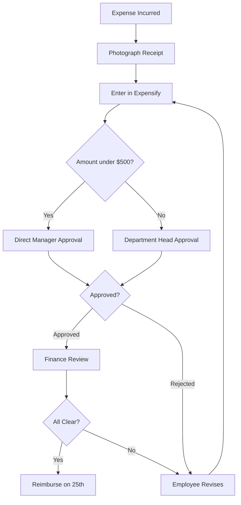

# Module 3: Advanced Use Cases — Expanding What You Can Do with AI Agents

## Introduction

### Review of Modules 1 and 2

In Module 1, you learned the basics of Claude Code: launching the terminal, entering prompts, and reading and writing files.

In Module 2, you developed three practical skills:

- **Research**: Gathering and organizing information from the web and internal documents
- **Document Creation**: Creating structured documents in Markdown
- **Data Analysis**: Reading CSV files, performing aggregations, and creating visualizations

### Where This Module Fits In

Module 3 introduces **11 use cases that are immediately applicable in real business scenarios**, building on the skills you have developed so far.

You now understand "what Claude Code can do." The goal of this module is to discover **where in your own work you can use it** and to put that into practice.

### How to Study This Module

| Part | Theme | Level of Detail | Estimated Time |
|------|-------|----------------|----------------|
| Part 1 | Streamlining Daily Tasks | Detailed (step by step) | 60 min |
| Part 2 | Automating Recurring Tasks | Detailed (step by step) | 60 min |
| Part 3 | Project-Based Applications | Overview + prompt examples | 30 min |
| Part 4 | Strategic Applications | Overview + prompt examples | 20 min |

Parts 1 and 2 are recommended for everyone. For Parts 3 and 4, choose the use cases most relevant to your work.

---

## Part 1: Streamlining Daily Tasks

> **Use Cases Covered**: Structuring meeting notes / Auto-converting standard reports / Data cleansing
>
> These use cases deliver immediate results for tasks that occur daily or weekly.

---

### Use Case 1: Structuring Meeting Notes

#### What Business Problem Does This Solve?

Have you ever experienced the following after a meeting?

- You took notes, but later thought "Wait, what was actually decided?"
- Action items are vague, with unclear owners and deadlines
- Meeting notes are scattered across messaging apps and notepads, making them hard to trace

In this use case, you pass **rough meeting notes** to Claude Code to automatically:

1. Generate structured meeting minutes
2. Extract decisions and action items
3. Convert action items into a format ready for filing as GitHub Issues

#### Detailed Workflow

```
[What to Prepare]
- Meeting notes (a text file or copy-pasteable text)
- GitHub repository (if you want to file Issues)
```

**Step 1: Save the meeting notes as a file**

First, save your meeting notes as a text file. If they are handwritten, roughly type them up. They do not need to be perfect.

Example file: `meeting-notes/2026-03-11-weekly.txt`

```
Weekly standup 3/11
Attendees: Tanaka, Sato, Suzuki, Takahashi

- Q1 revenue progress -> 85% achieved, remaining 15% attainable with 2 enterprise deals
- New feature release moved to 3/25 (originally 3/18) -> QA is delayed
- Sato to compile request list from Client A (by 3/14)
- Hiring: interviews for 2 engineers next week, Tanaka to coordinate schedules
- Marketing budget reallocation to be discussed at next meeting. Takahashi to draft a plan
- Suzuki: Competitor B announced a new plan, need to create a price comparison table
```

**Step 2: Ask Claude Code to structure the notes**

Enter the following prompt:

```
Read meeting-notes/2026-03-11-weekly.txt and structure the meeting minutes in the following format.

## Output Format
1. Meeting Minutes (Markdown format)
   - Meeting name, date, attendees
   - Summary by topic
   - Decisions (numbered list)
   - Action items (table with owner, task, deadline)

2. Action Item List (separate file)
   - Grouped by owner
   - Each item in GitHub Issue format (title, body, suggested labels)

Output:
- meeting-notes/2026-03-11-weekly-structured.md (structured minutes)
- meeting-notes/2026-03-11-weekly-actions.md (action items)
```

**Step 3: Review the output**

Review the files generated by Claude Code. The structured minutes should look roughly like this:

```markdown
# Weekly Standup Meeting Minutes

- **Date**: March 11, 2026
- **Attendees**: Tanaka, Sato, Suzuki, Takahashi

## Topics and Discussion

### 1. Q1 Revenue Progress
- Current achievement: 85%
- Outlook for remaining 15%: Attainable with 2 enterprise deals

### 2. New Feature Release Schedule
- Release date changed from 3/18 to **3/25**
- Reason: QA process delay

(continued...)

## Decisions
1. New feature release date changed to March 25
2. Q1 revenue target to be achieved via 2 enterprise deals

## Action Items

| # | Owner | Task | Deadline |
|---|-------|------|----------|
| 1 | Sato | Compile Client A's request list | 3/14 |
| 2 | Tanaka | Coordinate engineer interview schedules | Next week |
| 3 | Takahashi | Draft marketing budget reallocation plan | Before next meeting |
| 4 | Suzuki | Create Competitor B price comparison table | TBD |
```

**Step 4: File as GitHub Issues (optional)**

If you want to file action items as GitHub Issues, enter the following prompt:

```
File the action items from meeting-notes/2026-03-11-weekly-actions.md
as GitHub Issues.

Repository: our-team/project-tasks
Label: Add "meeting-action" to all
Owner GitHub accounts:
  Tanaka -> tanaka
  Sato -> sato
  Suzuki -> suzuki
  Takahashi -> takahashi
```

#### Expected Deliverables

| Deliverable | Format | Purpose |
|-------------|--------|---------|
| Structured minutes | Markdown file | Sharing and archiving |
| Action item list | Markdown file | Starting point for task management |
| GitHub Issues (multiple) | Issues | Actual task tracking |

#### Notes and Limitations

- **Watch for confidential information**: If meeting notes contain personal data or confidential matters, mask those sections before passing them to Claude Code
- **When additional context is needed**: If notes contain many abbreviations or internal jargon, adding a "glossary" to your prompt improves accuracy
- **Interpreting decisions**: Claude Code infers decisions from keywords like "changed to" or "decided." Always verify the final output
- **Verify before filing Issues**: Always review action item content and assignments before auto-filing

---

### Use Case 2: Auto-Converting Standard Reports

#### What Business Problem Does This Solve?

In business, it is common to report the same data in different levels of detail and formats:

- **Detailed version**: For yourself and your team, containing all the data
- **Summary version**: For your manager, focusing on key points
- **Shareable version**: For executives or other departments, emphasizing visuals

Creating these variations manually from a single detailed report is a significant burden. With Claude Code, you can auto-generate multiple versions from a single prompt.

#### Detailed Workflow

**Step 1: Prepare the detailed report**

Start with the most information-rich "detailed version." This will be the source for conversion.

Example file: `reports/monthly/2026-02-detail.md`

```markdown
# Sales Division Monthly Report — February 2026 (Detailed)

## 1. Sales Performance

### 1.1 Overall Summary
- Total revenue: $485,000 (103% of target)
- New customer revenue: $120,000 (24.7% of total)
- Existing customer revenue: $365,000 (75.3% of total)

### 1.2 By Segment
| Segment | Revenue | MoM Change | vs. Target |
|---------|---------|------------|------------|
| Enterprise | $210,000 | +12% | 110% |
| SMB | $180,000 | -3% | 95% |
| Startup | $95,000 | +8% | 105% |

### 1.3 Deal Details
(Detailed data for 20 individual deals...)

## 2. Pipeline Status
(Detailed opportunity list...)

## 3. Team KPIs
(Individual member performance...)

## 4. Issues and Countermeasures
(Detailed issue analysis...)
```

**Step 2: Specify conversion rules and request**

```
Read reports/monthly/2026-02-detail.md and generate the following three versions.

## 1. Summary Version (reports/monthly/2026-02-summary.md)
- Target audience: Department manager
- Length: Approximately one page
- Include: Overall revenue, target achievement, top 3 issues, next month's actions
- Exclude: Deal-by-deal details, individual KPIs
- Tone: Concise, fact-based

## 2. Executive Version (reports/monthly/2026-02-executive.md)
- Target audience: C-suite
- Length: 10 bullet points or fewer
- Include: Headline revenue numbers, month-over-month trends, key risks and opportunities
- Structure: "Key Highlights," "Risks & Opportunities," "Next Steps"
- Tone: Strategic, decision-oriented

## 3. Cross-Team Version (reports/monthly/2026-02-crossteam.md)
- Target audience: Marketing and Product teams
- Include: Customer feedback trends, segment-level trends, items requiring cross-team collaboration
- Exclude: Specific dollar amounts, personal names
- Tone: Collaborative ("We'd like your input on...")
```

**Step 3: Review and adjust each version**

Review the three generated files and request modifications as needed.

```
I reviewed reports/monthly/2026-02-executive.md.
Please make the following changes:
- Instead of "Revenue is strong," put the specific number (103% of target) in the headline
- Add "SMB segment down month-over-month" to the Risks section
```

#### Expected Deliverables

From the original detailed report (approximately 5 pages), the following three files are auto-generated:

| Version | Length | Primary Audience |
|---------|--------|-----------------|
| Summary | ~1 page | Department manager |
| Executive | 10 bullet points | C-suite |
| Cross-team | ~1 page | Marketing & Product teams |

#### Notes and Limitations

- **Always verify numbers**: Numbers may be rounded or accidentally changed during conversion. Always cross-check amounts and percentages against the original
- **Adjust nuance**: How strongly to emphasize "issues" depends on organizational culture and context. Review with human judgment after auto-generation
- **Manage confidentiality levels**: Verify that the cross-team version does not contain information that should not be shared
- **Create templates**: If you perform the same conversion monthly, save the prompt as a text file for reuse

---

### Use Case 3: Data Cleansing

#### What Business Problem Does This Solve?

Customer lists, vendor master data, product catalogs, and similar datasets accumulate the following problems over time:

- **Inconsistent formatting**: "ABC Inc.", "ABC, Inc.", "ABC Incorporated" all refer to the same entity
- **Duplicate records**: The same person registered under different spellings
- **Missing values**: Phone numbers or email addresses partially blank
- **Mixed formats**: Dates appearing as "3/11/2026," "2026-03-11," and "March 11" in the same file

Fixing these issues manually takes enormous time. Claude Code can perform rule-based bulk corrections.

#### Detailed Workflow

**Step 1: Prepare the data to be cleansed**

Prepare the data as a CSV or TSV file.

Example file: `data/customer-list-raw.csv`

```csv
company_name,contact_name,phone,email,address,registration_date
ABC Inc,John Smith,212-555-0100,jsmith@abc.com,123 Main St New York,4/1/2025
ABC Incorporated,John  Smith,2125550100,jsmith@abc.com,123 Main St. New York,2025-04-01
ABC Co.,Jane Doe,,jdoe@abc.com,,Apr 15 2025
Design Works LLC,Bob Jones,312-555-0199,bjones@dw.com,456 Oak Ave Chicago,2025/3/1
Design Works,Bob  Jones,3125550199,,456 Oak Avenue Chicago,03/01/2025
```

**Step 2: Define cleansing rules and request**

```
Read data/customer-list-raw.csv and perform data cleansing according to the following rules.

## Cleansing Rules

### Company Name Normalization
- Standardize "Inc", "Inc.", "Incorporated", "Co." to a single form
- When aliases appear to refer to the same entity, flag them for review

### Contact Name
- Standardize spacing between first and last names (single space)
- Normalize double spaces

### Phone Numbers
- Standardize to hyphenated format (e.g., 212-555-0100)
- Flag numbers with obviously incorrect digit counts

### Email Addresses
- Flag blank entries
- Perform basic format validation

### Dates
- Standardize all dates to YYYY-MM-DD format

### Duplicate Detection
- List records with similar company name + contact name as duplicate candidates
- Do not auto-merge; generate a report for human review

## Output
1. data/customer-list-cleaned.csv (cleansed data)
2. data/cleaning-report.md (report of changes: what was changed and how, items requiring review)
```

**Step 3: Review the cleansing report**

Claude Code generates the cleansed data along with a change report.

Expected report contents:

```markdown
# Data Cleansing Report

## Processing Summary
- Records processed: 5
- Records with changes: 5
- Duplicate candidates: 2 pairs

## Changes Made

### Company Name Normalization
| Row | Before | After |
|-----|--------|-------|
| 1 | ABC Inc | ABC Inc. |
| 3 | ABC Co. | ABC Inc. * requires review |
(continued...)

## Duplicate Candidates

### Candidate 1: ABC Inc. / John Smith
- Row 1: ABC Inc., John Smith, registered 2025-04-01
- Row 2: ABC Inc., John Smith, registered 2025-04-01
- **Assessment**: Likely the same person (please confirm)

## Items Requiring Review
1. Is "ABC Co." (Row 3) the same entity as "ABC Inc."?
2. Row 3: Email domain is the same (abc.com), suggesting the same entity
3. Row 5: Registration date "03/01/2025" was interpreted as March 1, 2025. Is this correct?
```

**Step 4: Incorporate review decisions**

Provide your answers to the review items and generate the final version.

```
Here are my answers to the review items in cleaning-report.md:

1. Yes, "ABC Co." is a shorthand for "ABC Inc." Please standardize to "ABC Inc."
2. Confirmed as above
3. That is correct

Please incorporate these answers and update the final customer-list-cleaned.csv.
Merge duplicate candidate 1 (keep Row 1 data, remove Row 2).
```

#### Expected Deliverables

| Deliverable | Format | Content |
|-------------|--------|---------|
| Cleansed data | CSV | Standardized formatting, duplicates removed |
| Cleansing report | Markdown | Change log and items requiring review |

#### Notes and Limitations

- **Back up the original data**: Always save the pre-cleansing data under a different name. Never overwrite it
- **Be cautious with auto-merging**: Always have a human make the final call on merging duplicate candidates. There is a risk of merging two different people who happen to share the same name
- **Large dataset processing**: For datasets exceeding several thousand rows, processing may take time. Validate your rules on a sample of ~100 rows first, then apply them to the full dataset
- **Personal data handling**: When working with customer names, contact information, and similar personal data, follow your organization's data handling policy

---

## Part 2: Automating Recurring Tasks

> **Use Cases Covered**: KPI/OKR dashboard data preparation / Process flow diagrams & procedure manuals / Building & updating an internal knowledge base
>
> These use cases streamline tasks that occur on a monthly or quarterly basis.

---

### Use Case 4: KPI/OKR Dashboard Data Preparation

#### What Business Problem Does This Solve?

In many organizations, KPI and OKR progress data is scattered across multiple sources:

- Revenue data in Spreadsheet A
- Customer satisfaction in Survey Tool B
- Development progress in GitHub Issues
- Marketing KPIs in Google Analytics reports

Every time the dashboard needs updating, manually collecting and reformatting this data is a major burden. Claude Code can convert data from disparate formats into a unified format.

#### Detailed Workflow

**Step 1: Prepare data from each source as files**

Export the data needed for your dashboard as CSV or Markdown files.

```
dashboard-data/
├── sales-202602.csv          # Revenue data (exported from spreadsheet)
├── csat-202602.csv           # Customer satisfaction (exported from survey tool)
├── dev-progress-202602.md    # Development progress (manually recorded notes)
└── marketing-kpi-202602.csv  # Marketing KPIs (exported from GA)
```

**Step 2: Request conversion to a unified format**

```
Read the 4 files under dashboard-data/ and create unified KPI dashboard data.

## Unified Format Specification

### File: dashboard-data/kpi-summary-202602.csv
Columns:
- Category (Revenue/Customer Satisfaction/Development/Marketing)
- KPI Name
- Target Value
- Actual Value
- Achievement Rate (%)
- Month-over-Month (%)
- Status (Achieved/On Track/At Risk/Below Target)

Status criteria:
- Achieved: Achievement rate >= 100%
- On Track: Achievement rate >= 80%
- At Risk: Achievement rate >= 60%
- Below Target: Achievement rate < 60%

### File: dashboard-data/kpi-commentary-202602.md
For each KPI:
- One-line numerical summary
- Notable points (if any)
- Recommended actions (for At Risk/Below Target items only)

## Notes
- Each file has a different format; interpret them appropriately
- dev-progress-202602.md is free-form text; extract relevant KPIs (releases, bug counts, etc.)
- For items where data is not available, enter "N/A" and note "Data collection needed" in the commentary
```

**Step 3: Generate dashboard visuals (optional)**

You can also generate a text-based dashboard.

```
Using kpi-summary-202602.csv, create a text-based dashboard.

Format: Markdown
Content:
- Overall achievement summary (ASCII art-style bar chart)
- Detailed table by category
- Highlighted at-risk KPIs

Output: dashboard-data/dashboard-202602.md
```

#### Expected Deliverables

| Deliverable | Format | Purpose |
|-------------|--------|---------|
| Unified KPI data | CSV | Import into dashboard tools |
| KPI commentary | Markdown | Supplementary material for executive meetings |
| Text dashboard | Markdown | Sharing via Slack or similar |

#### Notes and Limitations

- **Verify data interpretation**: Especially when extracting KPIs from free-form text, confirm that the interpretation is correct
- **Make it a monthly routine**: If you perform the same process monthly, save the prompt as a template file and change only the date portion for reuse
- **Source data quality**: The "garbage in, garbage out" principle still applies. Errors in source data will carry over into the integrated output

---

### Use Case 5: Process Flow Diagrams & Procedure Manuals

#### What Business Problem Does This Solve?

Business processes often exist only in people's heads or in fragmented notes. Many organizations face these challenges:

- When someone is out, nobody can run the process
- Onboarding new team members requires repeating the same explanations
- Process improvement is difficult because the current state is not visualized

With Claude Code, you can automatically generate **Mermaid flowcharts** and **step-by-step procedure manuals** from interview notes or verbal descriptions.

#### Detailed Workflow

**Step 1: Gather process information**

Compile interview notes, existing manual fragments, and chat messages into a text file.

Example file: `process-docs/expense-claim-notes.txt`

```
Expense reimbursement process (interview with Sato)

- Employee makes a purchase, takes a photo of the receipt
- Enters it into the expense system (Expensify)
- Under $500: direct manager approves
- Over $500: department head approval required
- After department head approval, Finance reviews
- If all is well, reimbursed on the 25th of the following month
- If rejected, the employee gets a revision request
- After revision, goes back through manager approval
- Month-end cutoff: must submit by the 10th of the following month, or it rolls to the month after
- Travel expenses are a separate flow (commuting passes go through HR, business trips through expense reimbursement)
```

**Step 2: Request flow diagram and procedure manual**

```
Read process-docs/expense-claim-notes.txt and create the following deliverables.

## 1. Flowchart (Mermaid format)
- Main flow (standard expense reimbursement)
- Clearly show branching conditions (under/over $500, approved/rejected)
- Output: process-docs/expense-claim-flow.md

## 2. Procedure Manual
- Target audience: New employees
- Write step by step
- Include "owner," "tools used," and "estimated time" for each step
- Include tips on common mistakes and things to watch out for
- Output: process-docs/expense-claim-manual.md

## 3. Open Questions List
- Organize points that could not be determined from the interview notes as a question list
- Output: process-docs/expense-claim-questions.md
```

**Step 3: Preview the flow diagram**

Mermaid-format flow diagrams can be previewed directly on GitHub. Review the generated file.

Expected Mermaid code example:

````markdown

````

**Step 4: Resolve open questions and update**

Once you get answers to the open questions, update the procedure manual.

```
Here are my answers to the questions in process-docs/expense-claim-questions.md:

Q1: What currency should international travel expenses be submitted in?
-> Submit in local currency equivalent. Use the day's exchange rate from Expensify.

Q2: What if the receipt is lost?
-> Create a self-certified expense statement and get the manager's signature.

Please incorporate these answers and update expense-claim-manual.md.
```

#### Expected Deliverables

| Deliverable | Format | Purpose |
|-------------|--------|---------|
| Flowchart | Mermaid syntax in Markdown | Process visualization and sharing |
| Procedure manual | Markdown | Onboarding and handoff documentation |
| Open questions list | Markdown | Follow-up interviews |

#### Notes and Limitations

- **On-the-ground verification is essential**: Always have the actual process owners review the generated flowchart and procedure manual. Interview notes alone may miss details
- **Pay attention to exceptions**: Claude Code prioritizes the main flow. Explicitly ask about and add exceptional cases (special requests, emergency procedures, etc.)
- **Version control**: We recommend managing procedure manuals with Git to track when and what changed as processes evolve

---

### Use Case 6: Building & Updating an Internal Knowledge Base

#### What Business Problem Does This Solve?

Is your organization's knowledge (expertise, know-how) scattered like this?

- Answers buried in specific messaging channels
- Tips written in personal note-taking apps or documents
- Manuals circulating as email attachments
- Tribal knowledge locked in individuals' heads ("Just ask that person")

With Claude Code, you can **structure this scattered documentation, organize it into a unified format, and manage it as a GitHub repository-based knowledge base**.

#### Detailed Workflow

**Step 1: Collect existing documents**

Gather scattered documents into one location.

```
knowledge-raw/
├── slack-exports/          # Exported messages from messaging apps
│   ├── faq-channel.json
│   └── tips-channel.json
├── documents/              # Existing documentation
│   ├── onboarding-guide.docx
│   ├── tool-setup.pdf
│   └── troubleshooting.md
└── notes/                  # Individual notes
    ├── tanaka-tips.txt
    └── sato-procedures.txt
```

**Step 2: Design the knowledge base structure**

```
Read all files under knowledge-raw/ and propose a structure for the internal knowledge base.

## Requirements
- Target audience: All employees (especially those in their first year)
- Propose a categorization scheme
- Create an article template (unified format)
- Consolidate overlapping content
- Flag content that may be outdated

## Output
1. knowledge-base/README.md (table of contents and usage guide)
2. knowledge-base/template.md (article template)
3. knowledge-base/structure-proposal.md (proposed structure and rationale for categorization)
```

**Step 3: Generate individual articles**

After reviewing the proposed structure, request individual article generation.

```
I will adopt the structure from structure-proposal.md.
Based on the content in knowledge-raw/, generate articles for the following categories:

1. knowledge-base/getting-started/ (onboarding-related)
2. knowledge-base/tools/ (tool setup and usage)
3. knowledge-base/troubleshooting/ (troubleshooting)
4. knowledge-base/processes/ (business processes)

Each article should follow the template.md format.
Record the original source (which file the information was extracted from) as metadata.
```

**Step 4: Establish a regular update workflow**

```
Create an update workflow document as knowledge-base/CONTRIBUTING.md.

Include:
- How to add new articles
- How to update existing articles
- Review process (who reviews)
- Criteria for archiving outdated articles
- How to maintain the glossary
```

#### Expected Deliverables

| Deliverable | Format | Purpose |
|-------------|--------|---------|
| Knowledge base repository structure | Directories + Markdown files | Internal wiki |
| Article template | Markdown | Template for new articles |
| Structure proposal | Markdown | Decision documentation |
| Operating guidelines | Markdown | Guidelines for ongoing updates |

#### Notes and Limitations

- **Information accuracy**: If original documents are outdated, generated articles will also contain outdated information. Set a "last verified date" for each article and run periodic review cycles
- **Access permissions**: Verify in advance whether all knowledge can be made available to all employees. Confidential documents may need to be managed in a separate repository
- **Build incrementally**: Trying to organize everything at once is overwhelming. Start with the most frequently asked-about area and expand gradually

---

## Part 3: Project-Based Applications

> **Use Cases Covered**: RFP draft creation / Contract risk check assistance / Multilingual content localization
>
> This section covers more complex, project-level tasks.
> Each use case provides an overview and prompt examples.

---

### Use Case 7: RFP (Request for Proposal) Draft Creation

#### Overview

An RFP (Request for Proposal) is an important document created when requesting system development or service implementation from external vendors. However, creating one is labor-intensive because:

- You need to design a standard structure from scratch
- Requirements are easily missed
- Many items require cross-departmental coordination

With Claude Code, you can auto-generate a **standardized RFP draft** from internal requirements notes and meeting minutes.

#### Prompt Example

```
Create an RFP (Request for Proposal) draft based on the following requirements notes.

## Requirements Notes
- Purpose: Replace the internal attendance management system
- Current system: On-premises custom system (10 years old)
- Issues: No mobile support, inconvenient for remote work, rising maintenance costs
- Budget: Under $50,000/year operating cost (up to $100,000 for initial implementation)
- Go-live target: October 2026
- Number of users: Approximately 300
- Must-have: Cloud-based, mobile app, integration with existing HR system (e.g., BambooHR)
- Nice-to-have: GPS clock-in, shift management, multi-language support

## RFP Structure
Follow this standard structure:
1. Company overview and project background
2. Current system overview and issues
3. Requirements for the new system (functional and non-functional)
4. Items to include in proposals
5. Evaluation criteria
6. Schedule
7. Proposal submission process
8. Contract terms

Output: rfp/attendance-system-rfp-draft.md

## Notes
- Organize functional and non-functional requirements in table format
- Assign priority levels to each requirement (Must-have / Should-have / Nice-to-have)
- Include a scoring rubric with the evaluation criteria
- Mark unclear or unconfirmed items with a [TBD] tag
```

#### Expected Deliverables

- RFP draft (Markdown, approximately 15-20 pages equivalent)
- List of items requiring confirmation (items needing further internal discussion)

#### Notes

- RFPs may be legally binding. Even at the draft stage, **always have your legal department review it**
- Replace any placeholder values Claude Code filled in for budgets or contract terms with official figures
- Since this document will be shared externally, **verify that no internal confidential information is included** in the final version

---

### Use Case 8: Contract Risk Check Assistance

#### Overview

When reviewing contracts or terms of service from vendors, you need to comprehensively check for concerns such as:

- Unfavorable clauses (one-sided termination conditions, excessive liability, etc.)
- Ambiguous language (clauses open to interpretation)
- Terms deviating from industry standards
- Missing clauses (confidentiality, anti-corruption, etc.)

Claude Code can streamline the **first-pass screening** based on a checklist.

#### Prompt Example

```
Read contracts/vendor-agreement-draft.pdf and perform a risk check
using the following checklist.

## Checklist

### 1. Basic Terms
- [ ] Full legal names and addresses of contracting parties
- [ ] Contract period (start date, end date)
- [ ] Auto-renewal clause and conditions
- [ ] Termination clause (notice period, penalties)

### 2. Fees & Payment Terms
- [ ] Clarity of pricing structure
- [ ] Payment terms
- [ ] Price increase provisions
- [ ] Currency risk allocation

### 3. Liability & Risk
- [ ] Cap on damages
- [ ] Limitation of liability
- [ ] Confidentiality clause
- [ ] Personal data handling
- [ ] Intellectual property ownership

### 4. Other
- [ ] Anti-corruption clause
- [ ] Force majeure clause
- [ ] Governing law and jurisdiction
- [ ] Dispute resolution mechanism

## Output Format
For each checklist item:
- Relevant clause (Article/Section number)
- Risk level (High / Medium / Low / No Issues)
- Specific concerns (if any)
- Recommended action

Output: contracts/risk-check-report.md
```

#### Expected Deliverables

- Risk check report (evaluation and recommended actions for each checklist item)
- Summary of negotiation points (summary of high-risk items)

#### Notes

> **Important**: Claude Code is not a legal expert. This use case is strictly a **first-pass screening aid**, and final decisions must always be made by **your legal department or attorneys**.

- Do not take Claude Code's findings at face value; use them as a lens for "Are there items that might have been overlooked?"
- Consider the confidentiality of the contract and verify in advance whether the data may be sent externally
- Judgments that depend on industry customs or past deal history are difficult for AI

---

### Use Case 9: Multilingual Content Localization

#### Overview

The need to deliver business content in multiple languages for global audiences is growing. However, simple machine translation causes these problems:

- Specialized terminology is not translated correctly
- Expressions do not fit the business context
- Translations do not match the company's standardized glossary

With Claude Code, **business-quality translation that references a glossary and understands context** is possible.

#### Prompt Example

```
Localize the following file into English.

Source: content/ja/product-update-202603.md
Output: content/en/product-update-202603.md

## Translation Rules
1. Refer to the glossary file (content/glossary-ja-en.csv) and use standardized terms
2. This is marketing content, so use natural, polished English
3. Translate ambiguous expressions from the source language into clear, explicit English
4. Do not translate proper nouns (product names, company names)
5. Convert date formats to "March 11, 2026" style
6. Keep monetary amounts in the original currency, adding approximate USD equivalents in parentheses

## Glossary Example
| Source Term | English | Notes |
|-------------|---------|-------|
| customer | customer | Do not use "client" |
| admin dashboard | Admin Console | Do not use "dashboard" |
| case study | Case Study | |

## Additional Output
If there are terms that should be added to the glossary, output them as content/glossary-additions.csv
```

#### Expected Deliverables

- Localized content (Markdown)
- Glossary addition candidates (CSV)

#### Notes

- A native speaker review of the final output is recommended
- For legally binding documents (contracts, etc.), use a professional translator
- Be aware of cultural nuance differences (e.g., formal expressions in one language may be unnecessary in another)
- For large volumes of content, translate a few pages first to verify quality before proceeding

---

## Part 4: Strategic Applications

> **Use Cases Covered**: Business plan scenario simulation / Grant application support
>
> These are more advanced use cases related to business strategy and executive decision-making.

---

### Use Case 10: Business Plan Scenario Simulation

#### Overview

When developing a business plan, preparing three scenarios ("optimistic," "baseline," and "pessimistic") is a standard approach. However, manually calculating the P&L for multiple variables is time-consuming and error-prone.

With Claude Code, you can generate **multi-scenario P&L projections** by changing assumptions and perform **sensitivity analysis** (which variable has the greatest impact on profit).

#### Prompt Example

```
Perform a profit/loss simulation for 3 scenarios based on the following assumptions.

## Business Overview
- Business: B2B SaaS product
- Monthly fee: $500/account
- Current accounts: 100
- Annual churn rate: Currently 10%

## Scenario Parameters

| Parameter | Optimistic | Baseline | Pessimistic |
|-----------|-----------|----------|-------------|
| Monthly new acquisitions | 15 | 10 | 5 |
| Annual churn rate | 5% | 10% | 20% |
| Price adjustment | +10% (from Oct) | No change | -5% (discount) |
| Headcount cost increase | +5% | +10% | +10% |
| Marketing spend | $20K/month | $15K/month | $10K/month |

## Fixed Conditions (All Scenarios)
- Initial team: 10 people (average salary $60K/year)
- Office costs: $8K/month
- Infrastructure: $5K/month + $5/account
- Other fixed costs: $3K/month

## Output
1. simulation/scenario-comparison.csv -- 12-month P/L by month (3 scenarios side by side)
2. simulation/scenario-summary.md -- Annual summary and key KPIs by scenario
3. simulation/sensitivity-analysis.md -- Sensitivity analysis (impact on annual profit when each parameter varies +/-20%)
4. simulation/break-even-analysis.md -- Break-even analysis (which month does each scenario turn profitable?)

## Notes
- Show your calculations so results can be verified
- If assumptions are insufficient, use reasonable defaults and note them explicitly
```

#### Expected Deliverables

| Deliverable | Content |
|-------------|---------|
| Scenario comparison table | 12-month P/L (3 scenarios) |
| Scenario summary | Annual revenue, costs, and profit comparison |
| Sensitivity analysis | Parameter impact ranking |
| Break-even analysis | Projected month of profitability |

#### Notes

- **Verify calculations**: Always spot-check a few cells by hand. Errors are especially likely in compound growth and cumulative calculations
- **Validate assumptions**: Simulation accuracy depends on assumption quality. Discuss the rationale for each parameter with the management team
- **Decision support, not prediction**: This simulation supports decision-making; it is not a forecast. Use it with the understanding that uncertainty is inherent
- **Regular updates**: We recommend comparing actual results quarterly and updating the parameters

---

### Use Case 11: Grant & Subsidy Application Support

#### Overview

Grants and subsidies are important funding sources for small businesses and startups. However, many organizations fail to take advantage of them because:

- Application requirements are complex and hard to assess eligibility for
- Applications require extensive documentation and take a long time to prepare
- Deadlines are short and preparation may not be completed in time

Claude Code can streamline **organizing the call-for-proposals requirements** and **drafting the application**.

#### Prompt Example

```
Read the following grant's call for proposals and help prepare the application.

## Target
Grant name: Small Business Innovation Grant 2026
Guidelines file: grants/sbig-2026-guidelines.pdf

## Task 1: Requirements Summary
Organize the application requirements in the following format:
- Eligibility (industry, size, location, etc.)
- Eligible expenses
- Subsidy rate and cap
- Application schedule
- Required documents list
- Evaluation criteria

Output: grants/sbig-2026-requirements.md

## Task 2: Eligibility Check
Our company's information:
- Industry: Information services
- Employees: 25
- Capitalization: $300,000
- Location: New York
- Planned purchase: Cloud project management tool ($1,000/month x 12 months)

Based on the above, verify whether we meet the eligibility criteria.
Output: grants/sbig-2026-eligibility.md

## Task 3: Application Draft
Create an application draft following the guidelines' documentation requirements.
- Business plan sections can use bullet-point placeholders (to be fleshed out later)
- Mark sections requiring company-specific information with a [TO BE COMPLETED] tag
- Structure the application to align with the evaluation criteria

Output: grants/sbig-2026-application-draft.md
```

#### Expected Deliverables

| Deliverable | Content |
|-------------|---------|
| Requirements summary | Structured summary of the call for proposals |
| Eligibility check | Assessment of whether eligibility criteria are met |
| Application draft | Draft aligned with documentation requirements |

#### Notes

- **Check for the latest information**: Grant requirements change by year and application round. Always refer to the most current call for proposals
- **Consult a specialist**: We recommend having the final application reviewed by an expert (such as a business consultant or grant specialist)
- **No false statements**: Application content must be factual. Do not use Claude Code's generated text as-is; always verify the facts
- **Manage deadlines**: Grants have strict deadlines. Complete the draft early and allow ample time for review and revisions

---

## Summary and Next Steps

### What You Learned in This Module

Module 3 significantly expanded the range of what you can do with Claude Code through 11 use cases.

| Category | Use Case | Key Takeaway |
|----------|----------|--------------|
| Daily Tasks | Structuring meeting notes | Unstructured data -> structured data conversion |
| Daily Tasks | Auto-converting reports | Generating multiple versions from a single source |
| Daily Tasks | Data cleansing | Rule-based batch processing with human verification |
| Recurring Tasks | KPI data preparation | Multi-source integration and standardization |
| Recurring Tasks | Flow diagrams & manuals | Converting tacit knowledge into explicit documentation |
| Recurring Tasks | Knowledge base construction | Consolidating scattered information with ongoing management |
| Project | RFP drafting | Document generation from requirements notes |
| Project | Contract risk checking | Checklist-based first-pass screening |
| Project | Multilingual localization | Glossary-referenced translation |
| Strategic | Scenario simulation | Multi-scenario generation via parameter changes |
| Strategic | Grant application support | Structuring calls for proposals and drafting applications |

### Common Success Patterns

Here are the patterns for effective use that are common across all use cases:

1. **Be clear about your inputs**: Provide specific files and rules, not vague instructions
2. **Specify the output format**: Explicitly state what file format and structure you want
3. **Work in stages**: Instead of requesting everything at once, break it into steps and review as you go
4. **Human review is essential**: Never take AI output at face value; always have a person review it
5. **Create templates**: Save frequently used prompts as files for reuse

### Next Steps

- **Work through the exercises**: Get hands-on practice in `exercises.md`
- **Use the reference**: Find prompt templates and a selection guide in `reference.md`
- **Apply to your own work**: Try mapping the patterns you learned to your actual tasks

> **Tip**: Start with the "quick win" use cases (1-3) and build up small successes. Once you experience the value firsthand, gradually expand your range of applications.
