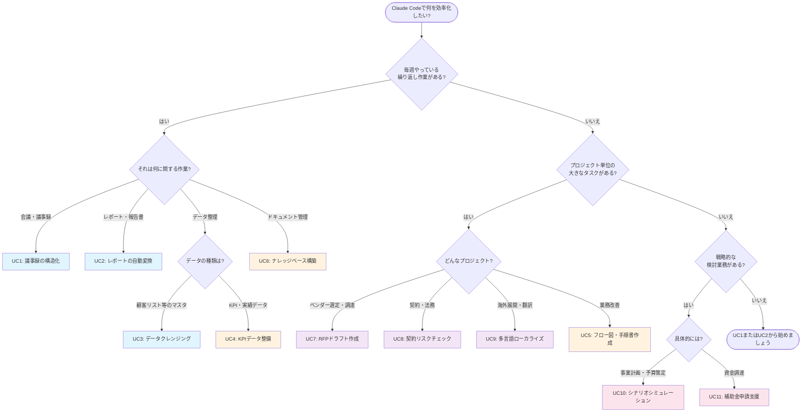

# Module 3: 応用ユースケース — リファレンス資料

---

## 1. ユースケース一覧表

### 概要マトリクス

| # | ユースケース | 業務領域 | 頻度 | インパクト | 難易度 |
|---|-------------|---------|------|-----------|--------|
| 1 | 議事録の構造化 | 全般 | 毎日〜毎週 | ★★★ | ★☆☆ |
| 2 | 定型レポートの自動変換 | 全般 | 毎週〜毎月 | ★★★ | ★☆☆ |
| 3 | データクレンジング | データ管理 | 随時 | ★★★ | ★★☆ |
| 4 | KPI/OKRダッシュボード用データ整備 | 経営企画 | 毎月 | ★★★ | ★★☆ |
| 5 | 業務フロー図・手順書作成 | 業務改善 | 随時 | ★★★ | ★☆☆ |
| 6 | 社内ナレッジベースの構築・更新 | 全般 | 随時（初回は大） | ★★★ | ★★☆ |
| 7 | RFPのドラフト作成 | 調達・IT | プロジェクト単位 | ★★☆ | ★★☆ |
| 8 | 契約書・規約のリスクチェック補助 | 法務・総務 | プロジェクト単位 | ★★☆ | ★★★ |
| 9 | 多言語コンテンツのローカライズ | マーケ・広報 | 随時 | ★★☆ | ★★☆ |
| 10 | 事業計画のシナリオシミュレーション | 経営企画 | 四半期〜年次 | ★★★ | ★★★ |
| 11 | 補助金・助成金の申請支援 | 経営企画・総務 | 年数回 | ★★★ | ★★★ |

### 凡例

- **インパクト**: 業務効率化への効果の大きさ（★3が最大）
- **難易度**: Claude Codeを使いこなすための習熟度（★3が最も高度）
- **頻度**: 一般的な実施頻度の目安

### 各ユースケースの概要

| # | 一言で言うと | 主なインプット | 主なアウトプット |
|---|-------------|---------------|-----------------|
| 1 | 走り書きメモを構造化された議事録に変換 | 会議メモ（テキスト） | 構造化議事録、アクションアイテム一覧 |
| 2 | 1つの詳細レポートから読者別に複数バージョンを生成 | 詳細版レポート | サマリー版、エグゼクティブ版、共有版 |
| 3 | 表記ゆれ・重複・欠損値をルールに従い一括修正 | CSVデータ | クレンジング済みCSV、変更レポート |
| 4 | バラバラなKPIデータを統一フォーマットに変換 | 複数CSV/Markdown | 統一KPI CSV、コメンタリー |
| 5 | ヒアリングメモからMermaidフロー図と手順書を自動生成 | 業務プロセスメモ | フローチャート、手順書、不明点リスト |
| 6 | 散在するドキュメントを構造化されたナレッジベースに整理 | 各種ドキュメント | ナレッジベース一式、運用ルール |
| 7 | 要件メモから標準構成のRFPドラフトを生成 | 要件メモ | RFPドラフト、要確認事項リスト |
| 8 | チェックリストに沿った契約書の一次スクリーニング | 契約書PDF/テキスト | リスクチェックレポート |
| 9 | 用語集参照付きでビジネスコンテンツを多言語翻訳 | 翻訳元ファイル、用語集 | ローカライズ済みコンテンツ |
| 10 | 前提条件を変えた複数シナリオの損益計算と感度分析 | パラメータ表 | 月次P/L、感度分析、損益分岐点分析 |
| 11 | 公募要項の構造化と申請書のドラフト作成 | 公募要項PDF | 要件整理表、適格性チェック、申請書ドラフト |

---

## 2. プロンプトテンプレート集

以下のテンプレートをコピーして、`○○` の部分を自分の業務に合わせて書き換えてご利用ください。

---

### テンプレート 1: 議事録の構造化

```
○○会議メモのファイルパス○○ を読んで、以下の形式で議事録を構造化してください。

## 出力形式
1. 議事録（Markdown形式）
   - 会議名: ○○会議名○○
   - 日時: ○○開催日時○○
   - 参加者: ○○参加者一覧○○
   - 議題ごとの要約
   - 決定事項（番号付きリスト）
   - アクションアイテム（担当者、内容、期限の表形式）

2. アクションアイテム一覧（別ファイル）
   - 担当者ごとにグループ化
   - 各アイテムをGitHub Issue形式（タイトル、本文、ラベル案）で記述

出力先:
- ○○出力先パス○○-structured.md（構造化議事録）
- ○○出力先パス○○-actions.md（アクションアイテム）

## 補足
- 期限が明示されていない項目には「期限未定」と記載してください
- 決定事項か検討中か判断がつかない場合は「要確認」と付記してください
- 社内用語の補足: ○○略語があれば「略語=正式名称」の形式で列挙○○
```

---

### テンプレート 2: 定型レポートの自動変換

```
○○詳細レポートのファイルパス○○ を読んで、以下のバージョンを生成してください。

## サマリー版（○○出力先パス○○-summary.md）
- 対象読者: ○○読者の役職や部門○○
- 分量: ○○A4で1枚 / 箇条書き10行以内 / など○○
- 含める内容: ○○含めたい項目をカンマ区切りで○○
- 除外する内容: ○○除外したい項目をカンマ区切りで○○
- トーン: ○○簡潔・事実ベース / 戦略的 / 協力依頼 / ポジティブ / など○○

## エグゼクティブ版（○○出力先パス○○-executive.md）
- 対象読者: ○○経営層 / 役員 / など○○
- 分量: 箇条書き10行以内
- 構成: 「Key Highlights」「Risks & Opportunities」「Next Steps」の3セクション
- トーン: 戦略的視点、意思決定に必要な情報のみ

## 他部門共有版（○○出力先パス○○-crossteam.md）
- 対象読者: ○○共有先の部門名○○
- 含める内容: ○○他部門にとって有用な情報○○
- 除外する内容: ○○具体的な金額、個人名、社内機密○○
- トーン: 協力依頼のニュアンス

## 注意事項
- 数値は原本から正確に転記してください
- ○○特定の情報○○は必ず含めてください
- ○○特定の情報○○は絶対に含めないでください
```

---

### テンプレート 3: データクレンジング

```
○○データファイルのパス○○ を読み込み、以下のルールでデータクレンジングを行ってください。

## クレンジングルール

### ○○列名1（例: 会社名）○○の正規化
- ○○変換ルール（例: 「(株)」→「株式会社」に統一し先頭に配置）○○
- 同一法人と推定される場合はフラグを立てる

### ○○列名2（例: 電話番号）○○の正規化
- ○○変換ルール（例: ハイフン付き形式に統一）○○
- 桁数不足等の明らかなエラーはフラグを立てる

### ○○列名3（例: 日付）○○の正規化
- ○○変換ルール（例: YYYY-MM-DD形式に統一、和暦は西暦に変換）○○

### 重複検出
- ○○重複判定の基準（例: 会社名＋担当者名が類似するレコード）○○
- 自動マージはせず、人間が判断できるようレポートを生成

## 出力
1. ○○出力先パス○○-cleaned.csv（クレンジング済みデータ）
2. ○○出力先パス○○-report.md（変更内容のレポート。変更前後の対比表、要確認事項の一覧）

## 注意事項
- 元データは上書きしないでください
- 判断が曖昧な変更は「要確認」フラグを付けてください
```

---

### テンプレート 4: KPI/OKRダッシュボード用データ整備

```
○○データディレクトリのパス○○ 配下のファイルを読み込み、
KPIダッシュボード用の統一データを作成してください。

## データソース
- ○○ファイル1のパス○○: ○○内容の説明（例: 売上データ）○○
- ○○ファイル2のパス○○: ○○内容の説明（例: 顧客満足度データ）○○
- ○○ファイル3のパス○○: ○○内容の説明（例: 開発進捗メモ）○○

## 統一フォーマット仕様

### ファイル: ○○出力先パス○○/kpi-summary.csv
列構成:
- カテゴリ（○○売上/顧客満足度/開発/マーケティング 等○○）
- KPI名
- 目標値
- 実績値
- 達成率（%）
- 前月比（%）
- ステータス（達成/順調/要注意/未達）

ステータスの判定基準:
- 達成: 達成率 >= 100%
- 順調: 達成率 >= ○○閾値○○%
- 要注意: 達成率 >= ○○閾値○○%
- 未達: 達成率 < ○○閾値○○%

### ファイル: ○○出力先パス○○/kpi-commentary.md
各KPIについて1行の要約と、要注意・未達項目への推奨アクション

## 注意事項
- 自由記述のデータからKPIを抽出する場合は、解釈の根拠を明記してください
- 数値が見つからない項目は「N/A」とし、「データ取得が必要」と記載してください
```

---

### テンプレート 5: 業務フロー図・手順書作成

```
○○ヒアリングメモのファイルパス○○ を読み、以下の成果物を作成してください。

## 1. フローチャート（Mermaid形式）
- 対象プロセス: ○○プロセス名（例: 経費精算プロセス）○○
- メインフロー（正常系）を記載
- 分岐条件: ○○分岐条件を記載（例: 5万円以下/超、承認/差し戻し）○○
- 例外フロー（差し戻し、エラー等）も記載
- 出力先: ○○出力先パス○○-flow.md

## 2. 業務手順書
- 対象読者: ○○新入社員 / 担当者 / マネージャー○○
- ステップバイステップで記載
- 各ステップに「担当者」「使用ツール」「所要時間の目安」を記載
- 注意事項やよくある間違いもTipsとして含める
- 出力先: ○○出力先パス○○-manual.md

## 3. 不明点リスト
- ヒアリングメモから読み取れなかった点を質問リストとして整理
- 各質問に「なぜこの情報が必要か」の理由も記載
- 出力先: ○○出力先パス○○-questions.md
```

---

### テンプレート 6: 社内ナレッジベースの構築・更新

```
○○ドキュメントディレクトリのパス○○ 配下のファイルをすべて読み込み、
社内ナレッジベースの構造を提案してください。

## 要件
- 対象読者: ○○全社員 / 特定部門 / 入社1年以内のメンバー○○
- カテゴリ分けの基準を提案してください
- 各記事のテンプレート（統一フォーマット）を作成してください
- 重複する内容は統合してください
- 内容が古い可能性があるものには「要更新確認」フラグを立ててください

## 出力
1. ○○出力先パス○○/README.md（ナレッジベースの目次と使い方）
2. ○○出力先パス○○/template.md（記事テンプレート）
3. ○○出力先パス○○/structure-proposal.md（構造案とカテゴリ分類の根拠）

## 記事テンプレートに含める項目
- タイトル
- カテゴリ
- 対象読者
- 最終更新日 / 最終確認日
- 本文
- 関連記事へのリンク
- 元の情報源（どのファイルから抽出したか）
```

---

### テンプレート 7: RFPのドラフト作成

```
以下の要件メモをもとに、RFP（提案依頼書）のドラフトを作成してください。

## 要件メモ
- 目的: ○○導入/リプレース/構築する対象○○
- 現行システム: ○○現行の概要と主な課題○○
- 予算規模: ○○年間○○万円以内（初期導入費用は別途○○万円まで）○○
- 導入時期: ○○運用開始の目標時期○○
- 利用人数: ○○約○○名○○
- 必須要件: ○○絶対に必要な機能・条件を列挙○○
- あればよい要件: ○○あると望ましい機能・条件を列挙○○

## RFPの構成
1. 会社概要・プロジェクト背景
2. 現行システムの概要と課題
3. 新システムへの要求事項（機能要件・非機能要件を表形式で）
4. 提案に含めてほしい事項
5. 評価基準（配点案付き）
6. スケジュール
7. 提案手続き
8. 契約条件

出力先: ○○出力先パス○○

## 注意事項
- 各要件に「必須/推奨/オプション」の優先度を付与
- 不明点や要確認事項は [要確認] タグ付きで記載
- 評価基準には配点案（合計100点）も含める
```

---

### テンプレート 8: 契約書・規約のリスクチェック補助

```
○○契約書のファイルパス○○ を読み、以下のチェックリストに沿って
リスクチェックを行ってください。

## チェックリスト

### 基本条項
- [ ] 契約当事者の正式名称と所在地
- [ ] 契約期間（開始日・終了日）
- [ ] 自動更新条項の有無と条件
- [ ] 解約条項（通知期間、違約金）

### 費用・支払条件
- [ ] 料金体系の明確性
- [ ] 支払サイト
- [ ] 値上げに関する条項
- [ ] 為替リスクの負担（該当する場合）

### 責任・リスク
- [ ] 損害賠償の上限
- [ ] 免責事項
- [ ] 秘密保持条項
- [ ] 個人情報の取り扱い
- [ ] 知的財産権の帰属

### その他
- [ ] 反社排除条項
- [ ] 不可抗力条項
- [ ] 準拠法・管轄裁判所
- [ ] 紛争解決方法

## 出力形式
各チェック項目について:
- 該当条項の箇所（第X条）
- リスクレベル（高/中/低/問題なし）
- 具体的な懸念事項（あれば）
- 推奨アクション

出力先: ○○出力先パス○○

※ このチェックは一次スクリーニングです。最終判断は必ず法務部門または弁護士が行ってください。
```

---

### テンプレート 9: 多言語コンテンツのローカライズ

```
以下のファイルを○○翻訳先言語（例: 英語）○○にローカライズしてください。

翻訳対象: ○○翻訳元ファイルのパス○○
出力先: ○○出力先パス○○

## 翻訳ルール
1. 用語集（○○用語集ファイルのパス○○）を参照し、統一された訳語を使用すること
2. コンテンツの種類: ○○マーケティング資料 / 技術文書 / 社内通知 / など○○
3. トーン: ○○フォーマル / カジュアル / 技術的 / 洗練された / など○○
4. 固有名詞（製品名、社名）は訳さないこと
5. 日付形式: ○○March 11, 2026 / 11 March 2026 / など○○
6. 金額表記: ○○日本円のまま表記しUSD概算を括弧内に付与 / 現地通貨に換算 / など○○
7. ○○その他の翻訳ルール（例: 日本語特有の曖昧表現は英語では明確に意訳）○○

## 追加出力
翻訳過程で用語集に追加すべき用語があれば、○○追加用語集のパス○○ として出力すること
```

---

### テンプレート 10: 事業計画のシナリオシミュレーション

```
以下の前提条件をもとに、3シナリオの損益シミュレーションを行ってください。

## 事業概要
- 事業内容: ○○事業の概要○○
- 収益モデル: ○○月額課金 / 一括 / 従量課金 / など○○
- 現在の規模: ○○現在の顧客数・売上等○○

## シナリオ別パラメータ

| パラメータ | 楽観 | 標準 | 悲観 |
|-----------|------|------|------|
| ○○パラメータ1（例: 月次新規獲得数）○○ | ○○値○○ | ○○値○○ | ○○値○○ |
| ○○パラメータ2（例: 年間解約率）○○ | ○○値○○ | ○○値○○ | ○○値○○ |
| ○○パラメータ3（例: 単価改定）○○ | ○○値○○ | ○○値○○ | ○○値○○ |
| ○○パラメータ4（例: 人件費増加率）○○ | ○○値○○ | ○○値○○ | ○○値○○ |
| ○○パラメータ5（例: マーケ費用）○○ | ○○値○○ | ○○値○○ | ○○値○○ |

## 固定条件（全シナリオ共通）
- ○○固定費用の内訳を列挙○○

## 出力
1. ○○出力先パス○○/scenario-comparison.csv — ○○期間○○分の月次P/L（3シナリオ並列）
2. ○○出力先パス○○/scenario-summary.md — シナリオ別の年間サマリーと主要KPI
3. ○○出力先パス○○/sensitivity-analysis.md — 感度分析（各パラメータを±20%変動させたときの年間利益への影響）
4. ○○出力先パス○○/break-even-analysis.md — 各シナリオの損益分岐点

## 注意事項
- 計算過程を明示し、検証可能な状態にしてください
- 仮定を置いた箇所はその旨を明記してください
```

---

### テンプレート 11: 補助金・助成金の申請支援

```
以下の補助金の公募要項を読み、申請準備を支援してください。

## 対象
補助金名: ○○補助金名（例: IT導入補助金2026）○○
公募要項ファイル: ○○公募要項ファイルのパス○○

## タスク1: 要件整理
以下の形式で公募要件を整理してください:
- 申請資格（業種、規模、所在地等）
- 補助対象経費の範囲
- 補助率と上限額
- 申請スケジュール
- 必要書類リスト
- 審査の評価ポイント
出力先: ○○出力先パス○○-requirements.md

## タスク2: 適格性チェック
当社の情報:
- 業種: ○○業種○○
- 従業員数: ○○人数○○名
- 資本金: ○○金額○○
- 所在地: ○○所在地○○
- 導入予定: ○○対象となる設備/ツール/事業の概要○○
出力先: ○○出力先パス○○-eligibility.md

## タスク3: 申請書ドラフト
公募要項の記載要件に沿って申請書のドラフトを作成してください。
- 事業計画の記載は箇条書きのプレースホルダでOK（後で肉付け）
- [要記入] タグで、当社の具体的な情報が必要な箇所を明示
- 審査の評価ポイントを意識した構成にすること
出力先: ○○出力先パス○○-draft.md
```

---

## 3. ユースケース選定フローチャート

> **「あなたに合ったユースケースの見つけ方」**
>
> 以下の質問に順番に答えていくと、まず取り組むべきユースケースが見つかります。

```
============================================================
   あなたに合ったユースケースの見つけ方
============================================================

Q1. 毎週やっている繰り返し作業がありますか?
    |
    +-- はい --> Q2へ
    |
    +-- いいえ --> Q5へ


Q2. それは何に関する作業ですか?
    |
    +-- 会議・議事録
    |   --> [ユースケース1] 議事録の構造化
    |       走り書きメモを構造化された議事録に変換
    |
    +-- レポート・報告書
    |   --> [ユースケース2] 定型レポートの自動変換
    |       1つの詳細レポートから読者別に複数バージョンを生成
    |
    +-- データ整理 --> Q3へ
    |
    +-- ドキュメント管理
        --> [ユースケース6] 社内ナレッジベースの構築・更新
            散在するドキュメントを整理して一元管理


Q3. どのようなデータを整理していますか?
    |
    +-- 顧客リスト・取引先マスタ等
    |   --> [ユースケース3] データクレンジング
    |       表記ゆれ・重複・欠損値をルールベースで一括修正
    |
    +-- KPI・実績データ
        --> [ユースケース4] KPI/OKRダッシュボード用データ整備
            複数ソースのデータを統一フォーマットに変換


Q5. プロジェクト単位の大きなタスクがありますか?
    |
    +-- はい --> Q6へ
    |
    +-- いいえ --> Q7へ


Q6. どのようなプロジェクトですか?
    |
    +-- ベンダー選定・システム調達
    |   --> [ユースケース7] RFPのドラフト作成
    |       要件メモから標準構成のRFPを生成
    |
    +-- 契約・法務関連
    |   --> [ユースケース8] 契約書のリスクチェック補助
    |       チェックリストに沿った一次スクリーニング
    |       ※最終判断は必ず法務部門が行うこと
    |
    +-- 海外展開・多言語対応
    |   --> [ユースケース9] 多言語コンテンツのローカライズ
    |       用語集参照付きのビジネス翻訳
    |
    +-- 業務改善・プロセス整備
        --> [ユースケース5] 業務フロー図・手順書作成
            暗黙知をMermaidフロー図と手順書に変換


Q7. 戦略的な検討業務がありますか?
    |
    +-- はい --> Q8へ
    |
    +-- いいえ
        --> まずはユースケース1（議事録の構造化）から
            始めてみましょう。最も手軽に効果を実感できます。


Q8. 具体的にはどのような検討ですか?
    |
    +-- 事業計画・予算策定
    |   --> [ユースケース10] シナリオシミュレーション
    |       複数シナリオの損益計算と感度分析
    |
    +-- 資金調達・補助金活用
        --> [ユースケース11] 補助金・助成金の申請支援
            公募要項の整理と申請書ドラフト作成

============================================================
迷ったら? --> ユースケース1（議事録の構造化）か
              ユースケース2（レポートの自動変換）から
              始めるのがおすすめです。
              難易度が低く、即効性が高いため、
              最初の成功体験を積みやすいユースケースです。
============================================================
```

### Mermaid版フローチャート

Mermaidに対応した環境（GitHub等）では、以下のフロー図も利用できます。



---

## 4. セキュリティ・注意事項チェックリスト

### 4.1 AIに渡すデータの確認事項（10項目）

AIにデータを渡す前に、以下の10項目を必ず確認してください。

| # | 確認事項 | 詳細 |
|---|---------|------|
| 1 | **個人情報の有無** | 氏名、住所、電話番号、メールアドレス、生年月日などの個人情報が含まれていないか。含まれる場合はマスキングまたはダミー化すること |
| 2 | **機密情報の有無** | 未公開の経営数値、事業戦略、M&A情報など、社外秘の情報が含まれていないか |
| 3 | **認証情報の混入** | APIキー、パスワード、アクセストークン、SSH鍵などの認証情報がファイルに混入していないか |
| 4 | **第三者の非公開情報** | 取引先の内部情報、顧客の非公開データ、競合他社の機密情報が含まれていないか |
| 5 | **契約上の制約** | NDA（秘密保持契約）や利用規約により、外部ツールへの入力が制限されていないか |
| 6 | **データの所有権** | そのデータをAIツールに入力する権限があるか。他社から預かったデータの場合は特に注意 |
| 7 | **規制対応** | 個人情報保護法、GDPR、業界固有の規制（金融、医療等）に抵触しないか |
| 8 | **社内ポリシーとの整合** | 自社のAI利用ポリシー、情報セキュリティポリシーに準拠しているか |
| 9 | **データ量の妥当性** | 必要以上に多くのデータを渡していないか。処理に必要な最小限のデータに絞ること |
| 10 | **バックアップの確保** | 元データのバックアップが取られているか。AIによる処理で元データが損なわれないよう別名保存されているか |

### 4.2 成果物のレビュー時の確認事項（5項目）

AIが生成した成果物を利用する前に、以下の5項目を確認してください。

| # | 確認事項 | 詳細 |
|---|---------|------|
| 1 | **数値の正確性** | 金額、パーセンテージ、日付などの数値が原本と一致しているか。変換や計算の過程でミスが入っていないか |
| 2 | **事実の正確性** | AIが元データにない情報を「推測」で追加していないか（ハルシネーション）。特に固有名詞、日付、数値に注意 |
| 3 | **情報の漏れ** | 重要な情報が成果物から抜け落ちていないか。元データと成果物を突き合わせて確認すること |
| 4 | **機密情報の混入** | 成果物（特に社外共有版）に、共有すべきでない機密情報や個人情報が含まれていないか |
| 5 | **文脈の妥当性** | 表現やニュアンスが対象読者・利用目的に合っているか。AIは文脈を完全に理解できないため、人間の判断が必要 |

### 4.3 ユースケース固有の注意事項

特定のユースケースでは、上記に加えて以下の固有の注意が必要です。

| ユースケース | 固有の注意事項 | 必須アクション |
|-------------|---------------|---------------|
| **UC1: 議事録の構造化** | 会議内容に人事評価・報酬・個人の健康情報等が含まれる場合がある | 議事録の共有範囲を事前に確認。該当部分はマスキング |
| **UC2: レポートの自動変換** | 他部門共有版に社内限定情報が混入するリスク | 各バージョンの「含めない情報」を明確に指定し、出力後に再確認 |
| **UC3: データクレンジング** | 顧客の個人情報を大量に扱う可能性 | 社内のデータ取り扱いポリシーに準拠。重複統合は必ず人間が判断 |
| **UC4: KPIデータ整備** | 未公開の経営数値が含まれる | データの取り扱い範囲を事前に確認 |
| **UC5: フロー図・手順書** | 生成されたフローに抜け漏れがある可能性 | **実際の担当者によるレビューが必須** |
| **UC6: ナレッジベース構築** | アクセス権限を考慮せず全情報を公開してしまうリスク | 機密レベル別にリポジトリを分離。公開範囲を事前に設計 |
| **UC7: RFPドラフト作成** | 法的拘束力を持つ場合がある。社内の機密情報が含まれるリスク | **法務部門のレビュー必須**。社外公開前に機密情報チェック |
| **UC8: 契約リスクチェック** | AIは法律の専門家ではない。見落としリスクがある | **法務部門または弁護士の最終判断が必須**。AIの指摘を鵜呑みにしない |
| **UC9: 多言語ローカライズ** | 翻訳品質の担保。文化的ニュアンスの違い | ネイティブスピーカーによる最終レビュー。法的文書の翻訳はプロに依頼 |
| **UC10: シナリオシミュレーション** | 計算ミスのリスク。前提条件の妥当性 | **手計算によるスポットチェック必須**。意思決定支援ツールであり予測ではない |
| **UC11: 補助金申請支援** | 虚偽記載は法令違反。最新の公募要件の確認 | **中小企業診断士・行政書士のレビュー推奨**。事実確認を必ず行う。最新の公募要項を参照 |

### 4.4 大切な原則: AIの出力は「ドラフト」である

すべてのユースケースに共通する最も重要な原則は、**Claude Codeの出力は常に「ドラフト（下書き）」であり、最終版ではない**ということです。

| ユースケース | 最終確認者 |
|-------------|-----------|
| 議事録 | 会議参加者 |
| レポート | データの原本保持者 |
| データクレンジング | データ管理者 |
| フロー図・手順書 | 実際の業務担当者 |
| RFP・契約書 | 法務部門・専門家 |
| シミュレーション | 経営メンバー |
| 補助金申請書 | 専門家（中小企業診断士等） |

AIを「完璧なアシスタント」ではなく「優秀だが確認が必要なドラフター」と捉えることで、安全かつ効果的に活用できます。

---

## 5. 推奨導入ステップ

### ステップ 1: 即効性の高いユースケースから始める（1週目）

**目標**: 「Claude Codeは便利だ」と実感する

```
推奨ユースケース:
  - ユースケース1: 議事録の構造化
  - ユースケース2: 定型レポートの自動変換

なぜこの2つから?
  - 難易度が低い（★☆☆）
  - 毎週発生する業務なので、すぐに試せる
  - 効果を実感しやすい（手作業30分 → 確認5分）
  - 失敗しても業務への影響が小さい

具体的なアクション:
  1. 次回の会議メモを、Claude Codeで構造化してみる
  2. 直近のレポートを、別の読者向けに変換してみる
  3. 出力結果を「使えるか/使えないか」で評価する
```

### ステップ 2: 成功体験を積む（2〜3週目）

**目標**: プロンプトの書き方に慣れ、出力品質を安定させる

```
推奨ユースケース:
  - ユースケース3: データクレンジング
  - ユースケース5: 業務フロー図・手順書作成

なぜこの2つ?
  - ステップ1の経験を活かせる
  - 「ルールを定義して実行」するパターンに慣れる
  - 成果物（きれいなデータ、わかりやすいフロー図）が目に見える

具体的なアクション:
  1. 手元にある「汚いデータ」を1つ選んでクレンジングしてみる
  2. 自分が担当している業務プロセスを1つフロー図にしてみる
  3. プロンプトを改善して再実行し、品質の変化を確認する
  4. うまくいったプロンプトはテンプレートとして保存する
```

### ステップ 3: 定期業務に展開する（1ヶ月目）

**目標**: Claude Codeを月次業務のワークフローに組み込む

```
推奨ユースケース:
  - ユースケース4: KPI/OKRダッシュボード用データ整備
  - ユースケース6: 社内ナレッジベースの構築・更新

なぜこの2つ?
  - 月次で繰り返す業務なので、一度仕組みを作れば毎月使える
  - プロンプトのテンプレート化による効率化が実感できる
  - チーム全体への波及効果が大きい

具体的なアクション:
  1. 月次KPIデータの統合をClaude Codeで行ってみる
  2. チーム内の散在ドキュメントを1つのナレッジベースに整理し始める
  3. プロンプトをテンプレートファイルとして保存し、月次ルーティンに組み込む
  4. 「先月は手作業で○時間かかった → 今月はClaude Codeで○分」を記録する
```

### ステップ 4: チーム全体に広げる（2ヶ月目〜）

**目標**: 自分だけでなくチーム全体でAI活用を推進する

```
推奨ユースケース:
  - ユースケース7〜11（業務に応じて選択）

なぜこのタイミング?
  - 自分自身が十分な経験を積んでいる
  - 成功事例と失敗事例の両方を共有できる
  - プロンプトテンプレートという「資産」がある

具体的なアクション:
  1. 自分の成功事例を5分のミニプレゼンにまとめる
  2. チームメンバーに1つのユースケースを試してもらう
  3. プロンプトテンプレートを共有リポジトリに置く
  4. 月1回の「AI活用振り返り会」を設定する
  5. 新しいユースケース（RFP、契約チェック等）を必要に応じて展開する

チーム展開時のポイント:
  - 「全員が同じユースケースを使う」必要はない
  - 各メンバーの業務に合ったユースケースを1つずつ試してもらう
  - 無理に広げようとせず、「便利だから使いたい」と自発的に広がるのが理想
  - セキュリティ・注意事項チェックリスト（本資料の第4章）を必ず共有する
```

### 導入ステップ全体像

```
                    1週目         2-3週目        1ヶ月目        2ヶ月目〜
                  +----------+  +----------+  +----------+  +----------+
ユースケース      | UC1, UC2 |  | UC3, UC5 |  | UC4, UC6 |  | UC7〜11  |
                  +----------+  +----------+  +----------+  +----------+
                       |             |              |              |
目標              実感する      慣れる        組み込む      広げる
                       |             |              |              |
スキル            基本操作      ルール定義    テンプレート  チーム展開
                  プロンプト    品質改善      ルーティン化  ナレッジ共有
                       |             |              |              |
効果の範囲        自分の        自分の        自分の月次    チーム全体
                  日常業務      随時業務      業務          の業務
```

---

## 付録: クイックリファレンス

### 「困ったときに見る表」

| こんなとき | 参照先 |
|-----------|-------|
| どのユースケースから始めればいいかわからない | 第3章: 選定フローチャート |
| プロンプトの書き方がわからない | 第2章: プロンプトテンプレート集 |
| AIにデータを渡して大丈夫か不安 | 第4章: セキュリティチェックリスト |
| 出力の品質が低い | テンプレートの「注意事項」セクションに条件を追加 |
| チームに広げたい | 第5章: 推奨導入ステップのステップ4 |
| ユースケースの詳しい手順を知りたい | `textbook.md` の該当ユースケース |
| 実際に手を動かして練習したい | `exercises.md` の演習問題 |
