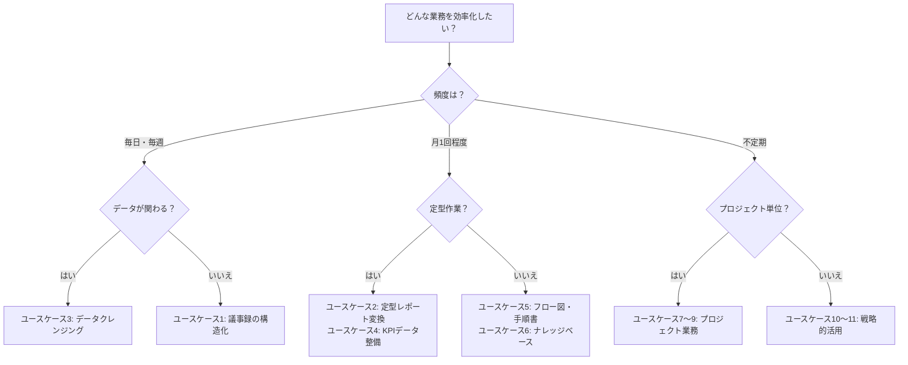

# Module 3: 応用ユースケース — AIエージェントの活用範囲を広げる

> **前提**: Module 1（基礎）とModule 2（実践スキル）を修了済みであること。リサーチ、資料作成、データ分析の基本操作ができること。
> **所要時間**: 約4〜5時間（通読＋ハンズオン）

---

## 目次

- [導入: Module 2までの振り返りとこのモジュールの位置づけ](#導入-module-2までの振り返りとこのモジュールの位置づけ)
- [Part 1: 日常業務の効率化](#part-1-日常業務の効率化)
- [Part 2: 定期業務の自動化](#part-2-定期業務の自動化)
- [Part 3: プロジェクト業務での活用](#part-3-プロジェクト業務での活用)
- [Part 4: 戦略的活用](#part-4-戦略的活用)
- [まとめ](#まとめ)

---

## 導入: Module 2までの振り返りとこのモジュールの位置づけ

### これまでに身につけたスキル

Module 1と2を通じて、あなたは以下の「コアスキル」を身につけました。

| Module | 身につけたコアスキル |
|--------|---------------------|
| Module 1 | Claude Codeの基本操作、ファイル操作、CLAUDE.mdの活用 |
| Module 2 | 効果的な指示の出し方、リサーチ、資料作成、データ分析 |

これらのスキルは、いわば「部品」のようなものです。Module 3では、この部品を **組み合わせて** 、より多くの業務に適用する方法を学びます。

### Module 3のアプローチ

```
┌──────────────────────────────────────────────────────┐
│                Module 3 の考え方                      │
│                                                      │
│  コアスキル（部品）        応用ユースケース（完成品）  │
│                                                      │
│  リサーチ ─────┐                                     │
│                ├──→ 議事録の構造化                    │
│  資料作成 ─────┤                                     │
│                ├──→ 定型レポートの自動変換             │
│  データ分析 ───┤                                     │
│                ├──→ KPIデータの整備                   │
│  ファイル操作 ─┤                                     │
│                ├──→ ナレッジベースの構築               │
│  指示の技術 ──┘                                     │
│                    ...他にも多数                      │
│                                                      │
│  → スキルの「組み合わせ方」を学ぶのが Module 3       │
└──────────────────────────────────────────────────────┘
```

このModuleでは、以下の4つのパートに分けて **11のユースケース** を紹介します。

| パート | 内容 | 詳しさ |
|--------|------|--------|
| Part 1 | 日常業務の効率化 | 詳細解説（ステップバイステップ） |
| Part 2 | 定期業務の自動化 | 詳細解説（ステップバイステップ） |
| Part 3 | プロジェクト業務での活用 | 概要＋指示例 |
| Part 4 | 戦略的活用 | 概要＋指示例 |

Part 1・2は「明日からすぐ使える」内容を厚めに解説し、Part 3・4は「こういう使い方もできる」という引き出しを増やすことを目的としています。

---

## Part 1: 日常業務の効率化

### ユースケース1: 議事録の構造化と意思決定ログ

#### 課題

会議のあとに残るメモやチャットの記録、文字起こしテキストには、大切な情報が埋もれがちです。

```
┌────────────────────────────────────────────────┐
│              よくある困りごと                    │
│                                                │
│  「あの件、結局どうなったんだっけ？」            │
│  「誰がいつまでにやることになった？」            │
│  「先月の会議で決めたはずなのに記録がない...」   │
│                                                │
│  原因:                                         │
│  ・会議メモが走り書きのまま放置されている        │
│  ・「決定事項」と「議論中の話題」が混在          │
│  ・アクションアイテムに担当者や期限がない        │
│  ・メモの場所がバラバラ（ノート、チャット、メモ帳）│
└────────────────────────────────────────────────┘
```

#### ワークフロー: 文字起こしテキストから構造化された議事録へ

このワークフローでは、会議の文字起こしテキスト（もしくは走り書きのメモ）を、「何が決まったか」「誰が何をするか」が一目でわかる構造化された議事録に変換します。

```
文字起こしテキスト
       ↓
  Claude Code で構造化
       ↓
  構造化Markdown（議事録）
  ├── 基本情報（日時・参加者）
  ├── 議題ごとの議論要約
  ├── 決定事項の一覧
  ├── アクションアイテム（担当者・期限付き）
  └── 保留事項・次回持ち越し
       ↓
  （オプション）GitHub Issueとして起票
```

#### ステップ1: 会議メモを準備する

まず、会議のメモや文字起こしテキストをテキストファイルとして保存します。完璧な文章でなくて構いません。走り書きメモ程度の内容でも、Claude Codeが読み取って構造化してくれます。

**文字起こしテキストの例（data/meeting-raw.txt として保存）:**

```
3/10の定例ミーティング
出席: 田中部長、佐藤、鈴木、山田（オンライン参加）

田中さんから新しい社内ポータルの話。4月中にリリースしたい。
佐藤さんがデザイン案を出してて、Aパターンでいくことに決定。
鈴木さんが技術的にはAパターンなら3週間でいけるとのこと。
ただしモバイル対応は間に合わないかもなので、第2フェーズにまわす。

予算について。当初150万だったけど追加で30万必要。
田中部長が承認。合計180万。

山田さんからマニュアル作成の件。誰がやるか未定。
次回までに担当者を決めること。

次回は3/17の同じ時間。
```

#### ステップ2: Claude Codeで構造化する

```
data/meeting-raw.txt を読み込んで、構造化された議事録を作成してください。

以下の形式でMarkdownファイルにまとめてください:

1. 会議基本情報（日時、場所/形式、参加者）
2. 議題一覧（番号付き）
3. 各議題の詳細
   - 議論の要約（箇条書きで簡潔に）
   - 決定事項（決まったことを明確に）
4. アクションアイテム一覧
   - 表形式で: アクション内容 / 担当者 / 期限 / ステータス
5. 保留事項（今回決まらなかったこと、次回持ち越し）
6. 次回会議の予定

output/minutes/2026-03-10_定例ミーティング.md に保存してください。
```

**期待される出力のイメージ:**

Claude Codeが走り書きメモを読み取り、議題ごとに整理された議事録を生成します。決定事項とアクションアイテムが明確に分離され、担当者と期限が付いたテーブルが含まれます。

#### ステップ3: アクションアイテムをGitHub Issueとして起票する（オプション）

**GitHub Issue（ギットハブ・イシュー）とは**: プロジェクトの「やるべきこと」を管理するためのチケットシステムです。「課題管理表」や「タスク管理ボード」のようなものと考えてください。

議事録のアクションアイテムをGitHub Issueとして起票しておくと、進捗管理がしやすくなります。

```
output/minutes/2026-03-10_定例ミーティング.md のアクションアイテムを確認して、
各アクションアイテムを個別のGitHub Issueとして起票してください。

各Issueには以下を含めてください:
- タイトル: アクションの内容を簡潔に
- 本文: 背景（どの会議で決まったか）、詳細、期限
- ラベル: "meeting-action" を付与

起票結果の一覧を output/minutes/2026-03-10_issues.md にまとめてください。
```

> **ポイント**: GitHub Issueの起票はModule 1で学んだGit/GitHub連携の応用です。初めての場合はこのステップはスキップして、まずは議事録の構造化だけから始めても十分に効果があります。

#### 日常的に使いこなすコツ

- **CLAUDE.mdに議事録のフォーマットを定義しておく**: 毎回の指示がシンプルになります
- **会議直後に実行する**: 記憶が新しいうちにClaude Codeに構造化させ、抜け漏れをチェックする
- **テンプレートを育てる**: 最初の議事録をテンプレートとして保存し、次回以降は「前回と同じ形式で」と指示する

---

### ユースケース2: 定型レポートの自動変換

#### 課題

同じ情報を、読む人に合わせて複数のフォーマットで作成し直す作業は、多くのビジネスパーソンが経験する手間のかかる仕事です。

```
┌────────────────────────────────────────────────┐
│          同じ情報を何度も「焼き直す」作業        │
│                                                │
│  詳細な月次報告書（10ページ）                    │
│       │                                        │
│       ├──→ 上長向けサマリー（1ページ）           │
│       │     要点だけ抽出、数字中心              │
│       │                                        │
│       ├──→ 部門会議用（3ページ）                │
│       │     アクションアイテム重視              │
│       │                                        │
│       └──→ 全社共有用（スライド風）             │
│             図表多め、専門用語を平易に           │
│                                                │
│  → 毎月この作業に半日かかっている...            │
└────────────────────────────────────────────────┘
```

#### ワークフロー: 詳細版から各フォーマットへの自動変換

#### ステップ1: 詳細版レポートを用意する

まず、最も詳しい版のレポートを作成（または既存のものを配置）します。このレポートが「マスターデータ」（原本）の役割を果たします。

```
data/reports/2026-02_monthly-report-full.md を読み込んでください。
このファイルは2月の月次報告書（詳細版）です。
内容を把握した上で、3種類のバリエーションを作成していきます。
```

#### ステップ2: 上長向けサマリーを生成する

```
data/reports/2026-02_monthly-report-full.md の内容を元に、
上長（部長クラス）向けの1ページサマリーを作成してください。

要件:
- A4で1ページに収まる分量（800〜1000字程度）
- 主要KPIを表形式で冒頭に配置
- 「結論→根拠→次のアクション」の順で記述
- 数値は万円単位・%表示で統一
- 詳細版との整合性を必ず保つこと

output/reports/2026-02_summary-executive.md に保存してください。
```

#### ステップ3: 部門会議用バージョンを生成する

```
同じ data/reports/2026-02_monthly-report-full.md を元に、
部門会議で使う資料を作成してください。

要件:
- 分量: 3ページ程度（2000〜3000字）
- 構成:
  1. 先月の振り返り（KPI達成状況のテーブル）
  2. トピックス（重要な出来事を3つに絞る）
  3. 課題と対策（具体的なアクションプラン付き）
  4. 今月の目標と担当者一覧（テーブル形式）
- 参加者が議論しやすいよう、各トピックの末尾に「議論ポイント」を記載

output/reports/2026-02_summary-team.md に保存してください。
```

#### ステップ4: 全社共有用バージョンを生成する

```
同じ data/reports/2026-02_monthly-report-full.md を元に、
全社向けの共有資料を作成してください。

要件:
- 専門用語は使わない（または初出時に説明を添える）
- 視覚的にわかりやすく（Markdownのテーブルやリストを活用）
- ポジティブな成果を冒頭でハイライト
- 分量: 1500〜2000字程度
- トーン: 親しみやすく、全社員が「自分事」として読めるように

output/reports/2026-02_summary-company.md に保存してください。
```

#### ステップ5（応用）: 変更点ハイライトを自動付与する

前月のレポートとの差分を比較して、変更点を自動でハイライトすることもできます。

**diff（ディフ/差分）とは**: 2つのファイルの内容を比較して「どこが変わったか」を見つけることです。Claude Codeにはファイルの比較機能が備わっています。

```
以下の2つのファイルを比較してください:
- output/reports/2026-01_summary-executive.md（先月の上長向けサマリー）
- output/reports/2026-02_summary-executive.md（今月の上長向けサマリー）

比較結果として以下を作成してください:
1. 変更点のサマリー（主要な数値の増減を箇条書きで）
2. 今月のサマリーに「前月比」のコメントを追記した強化版

output/reports/2026-02_summary-executive-with-diff.md に保存してください。
```

#### 日常的に使いこなすコツ

- **テンプレートを固定する**: 各バリエーションのフォーマットが安定したら、CLAUDE.mdに「上長向けサマリーはこの形式で」と定義しておく
- **一括変換の指示を作る**: 慣れてきたら「詳細版を読み込んで、3種類すべてを一括で生成して」と1回の指示で済ませる
- **レビューの観点を決めておく**: 自動変換後にチェックすべきポイント（数値の整合性、トーンの適切さ）をリスト化しておく

---

### ユースケース3: データクレンジング

#### 課題

顧客リストや商品マスタなど、日々の業務で使うデータは、時間が経つにつれて「汚れて」いきます。

**データクレンジングとは**: データの中にある表記のばらつき、重複、欠損（空欄）などを見つけて修正し、データの品質を高める作業のことです。

```
┌────────────────────────────────────────────────┐
│           データが「汚れる」典型パターン         │
│                                                │
│  【表記ゆれ】                                  │
│    株式会社ABC / (株)ABC / ABC株式会社          │
│    東京都港区 / 東京都 港区 / 港区（東京）       │
│                                                │
│  【重複】                                      │
│    同じ顧客が別の表記で2行に登録されている       │
│    メールアドレスは同じだが会社名が微妙に違う    │
│                                                │
│  【欠損】                                      │
│    電話番号が空欄 / 業種が「その他」のまま       │
│    担当者名があるのに部署名がない               │
│                                                │
│  → 正確な分析や報告ができなくなる              │
└────────────────────────────────────────────────┘
```

#### ワークフロー: CSV読み込みからクレンジング完了まで

```
元のCSVファイル（汚れたデータ）
       ↓
  ステップ1: 現状把握（品質チェック）
       ↓
  ステップ2: 表記ゆれの統一
       ↓
  ステップ3: 重複の検出・統合
       ↓
  ステップ4: 欠損データの補完
       ↓
  クレンジング済みCSV ＋ 変更ログ
```

#### ステップ1: データの品質チェック

まず、データの現状を把握します。

```
data/customer-list.csv を読み込んで、データ品質レポートを作成してください。

以下の観点でチェックしてください:
1. 基本情報: 行数、列数、各列のデータ型
2. 欠損値: 各列の欠損数と欠損率
3. 表記ゆれの候補:
   - 会社名の表記パターン（「株式会社」「(株)」等の混在）
   - 住所の表記パターン
   - 電話番号のフォーマット（ハイフンあり/なし等）
4. 重複の候補: 会社名やメールアドレスが類似している行
5. 異常値: 明らかにおかしいデータ（例: 電話番号の桁数不足）

output/data-quality-report.md にレポートを保存してください。
```

**期待される出力のイメージ:**

データの全体像と問題点がまとまったレポートが生成されます。「会社名の表記パターンが5種類ある」「電話番号の欠損が23件」といった具体的な数値が示されます。

#### ステップ2: 表記ゆれの統一

```
data/customer-list.csv の表記ゆれを統一してください。

統一ルール:
- 会社名: 「株式会社」は正式名称で統一（「(株)」「㈱」→「株式会社」に変換）
         会社名の前後の空白を削除
- 住所: 都道府県名は省略しない（「港区」→「東京都港区」のように補完）
       全角数字→半角数字に統一
       丁目・番地のハイフンは「-」に統一
- 電話番号: ハイフン付きに統一（例: 03-1234-5678）
           半角数字に統一
- メールアドレス: すべて小文字に統一

変更前後の対応表を output/cleansing-log-normalization.md に記録してください。
統一済みデータを output/customer-list-normalized.csv に保存してください。
```

#### ステップ3: 重複の検出と統合

```
output/customer-list-normalized.csv を読み込んで、
重複データを検出・統合してください。

重複判定の基準（優先順位順）:
1. メールアドレスが完全一致
2. 会社名が完全一致かつ電話番号が一致
3. 会社名の類似度が高い（表記の微妙な違いを含む）

統合ルール:
- 重複が見つかった場合、より情報が多い行（欠損が少ない行）を残す
- 両方の行にしかない情報がある場合は統合する
- 統合に迷う場合は「要確認」フラグを付ける

重複検出結果を output/cleansing-log-duplicates.md に記録してください。
統合済みデータを output/customer-list-deduped.csv に保存してください。
```

#### ステップ4: 欠損データの補完

```
output/customer-list-deduped.csv を読み込んで、
欠損データの補完を行ってください。

補完ルール:
- 都道府県: 住所から推定できる場合は補完
- 業種: 会社名やドメイン名から推定できる場合は補完（推定した場合は「※推定」と注記）
- 電話番号・メールアドレス: 推定では補完しない（空欄のまま残し、リストとして出力）

補完できなかった欠損のリストを output/cleansing-log-missing.md に出力してください。
最終版データを output/customer-list-cleaned.csv に保存してください。
```

#### ステップ5: クレンジングサマリーの作成

```
以下のファイルを読み込んで、データクレンジングの全体サマリーを作成してください:
- output/data-quality-report.md
- output/cleansing-log-normalization.md
- output/cleansing-log-duplicates.md
- output/cleansing-log-missing.md

サマリーに含める内容:
1. クレンジング前後の比較（件数の変化、品質スコア）
2. 各ステップでの変更件数
3. 残存する課題（手動対応が必要な項目）
4. 今後の推奨アクション（データ入力ルールの整備など）

output/cleansing-summary.md に保存してください。
```

#### 日常的に使いこなすコツ

- **「クレンジングルール」をCLAUDE.mdに定義する**: 自社のデータ表記ルールを一度決めておくと、毎回の指示が簡潔になります
- **定期的に実行する**: 月1回など、定期的にクレンジングを行うことでデータ品質を維持できます
- **変更ログを必ず残す**: 「何をどう変えたか」の記録は、問題が発生した時のトレースに不可欠です

---

## Part 2: 定期業務の自動化

### ユースケース4: KPI/OKRデータ整備

#### 課題

多くの企業では、各部門がそれぞれ独自のフォーマットでKPI（重要業績評価指標）やOKR（目標と成果指標）のデータを管理しています。

**KPI（ケーピーアイ）とは**: Key Performance Indicatorの略で、目標の達成度を測るための指標です。例えば「月間売上」「新規顧客数」「顧客満足度」などがKPIにあたります。

**OKR（オーケーアール）とは**: Objectives and Key Resultsの略で、「目標（Objective）」と「その達成を測る成果指標（Key Results）」をセットで管理する手法です。

```
┌────────────────────────────────────────────────┐
│          部門ごとにバラバラなデータ管理          │
│                                                │
│  営業部: Excelファイル（月次更新）              │
│    → 列名が独自、金額の単位がバラバラ          │
│                                                │
│  マーケ部: Google Sheetsからのエクスポート      │
│    → 日付フォーマットが違う、集計期間がズレ     │
│                                                │
│  カスタマーサクセス: 社内システムのCSV出力      │
│    → 項目名が英語、独自のコード体系            │
│                                                │
│  経営企画部の悩み:                              │
│  「全社ダッシュボードを作りたいのに、           │
│    データを揃えるだけで丸1日かかる...」         │
└────────────────────────────────────────────────┘
```

#### ワークフロー: バラバラなデータの統合と分析

#### ステップ1: 各部門のデータを読み込んで構造を把握する

```
以下の3つのCSVファイルを読み込んで、それぞれの構造を比較してください:
- data/kpi/sales-kpi.csv（営業部のKPIデータ）
- data/kpi/marketing-kpi.csv（マーケティング部のKPIデータ）
- data/kpi/cs-kpi.csv（カスタマーサクセス部のKPIデータ）

各ファイルについて以下をまとめてください:
- 列名と想定されるデータの意味
- 日付のフォーマット
- 数値の単位や表記方法
- 集計期間（月次/週次/日次）
- データの期間（いつからいつまでか）

3つのファイルの差異を比較表にまとめて、
output/kpi/data-structure-comparison.md に保存してください。
```

#### ステップ2: 統一フォーマットに変換する

```
output/kpi/data-structure-comparison.md の比較結果を踏まえて、
3つのCSVファイルを統一フォーマットに変換してください。

統一ルール:
- 日付: YYYY-MM 形式に統一
- 金額: 円単位（整数）に統一、カンマなし
- 比率: 小数点1桁の%表示に統一（例: 85.3）
- 列名: 日本語で統一（部門名_指標名 の形式）
- 欠損値: 空欄のままにする（0で埋めない）

統一フォーマットのCSVを output/kpi/consolidated-kpi.csv に保存してください。
変換ルールの詳細を output/kpi/conversion-rules.md に記録してください。
```

#### ステップ3: 前月比・達成率を自動計算する

```
output/kpi/consolidated-kpi.csv を読み込んで、
以下の計算を追加してください:

1. 各KPIの前月比（%）
2. 目標値に対する達成率（%）
   - 目標値は data/kpi/targets.csv に定義されています
3. 異常値の検出
   - 前月比が±30%以上変動した項目にフラグを付ける
   - 達成率が50%未満の項目にフラグを付ける

計算結果を output/kpi/kpi-with-calculations.csv に保存してください。
異常値のアラート一覧を output/kpi/anomaly-alerts.md に保存してください。
```

#### ステップ4: 経営レビュー用レポートを生成する

```
output/kpi/kpi-with-calculations.csv と
output/kpi/anomaly-alerts.md を読み込んで、
経営レビュー会議用のKPIレポートを作成してください。

レポート構成:
1. 全社KPIサマリー（主要指標の一覧テーブル、達成率による色分け説明付き）
2. 部門別ハイライト（各部門の注目ポイントを3行以内で）
3. 異常値・注意項目（フラグが付いた項目の一覧と考えられる要因）
4. 前月比トレンド（改善/悪化の傾向を部門横断で分析）
5. 推奨アクション

Markdownレポート: output/kpi/kpi-report.md
HTMLダッシュボード: output/kpi/kpi-dashboard.html
両方を作成してください。HTMLはChart.jsでグラフを含めてください。
```

---

### ユースケース5: 業務プロセスのフロー図・手順書作成

#### 課題

業務プロセスの「見える化」は重要だとわかっていても、フロー図や手順書を作る時間がなかなか取れないものです。

```
┌────────────────────────────────────────────────┐
│         業務プロセスの「見える化」の壁           │
│                                                │
│  ・ベテラン社員の頭の中にしかない手順がある      │
│  ・フロー図を書くツールの使い方がわからない      │
│  ・手順書を書いても更新されずに陳腐化する        │
│  ・属人化したまま引き継ぎ時期を迎えてしまう      │
└────────────────────────────────────────────────┘
```

#### ワークフロー: ヒアリングメモからフロー図と手順書を同時作成

**Mermaid（マーメイド）とは**: テキストで図を描くための記法（書き方のルール）です。特別なソフトウェアがなくても、テキストを書くだけでフローチャートや図表を作成できます。GitHubでは、MermaidのテキストをそのままMarkdownに書くとフロー図として表示されます。

#### ステップ1: ヒアリングメモを用意する

ベテラン社員へのヒアリング結果、あるいは自分自身の業務手順のメモを用意します。

**ヒアリングメモの例（data/process/expense-flow-memo.txt として保存）:**

```
経費精算の流れ（田中さんヒアリングメモ）

申請者がまず経費精算書をExcelで作成。
領収書の写真を撮ってExcelに貼り付け。
金額が1万円以上だと部長承認が必要。1万円未満なら課長承認でOK。
承認されたら経理部に回す。
経理がチェックして問題なければ翌月15日に振り込み。
差し戻しがあったら申請者に戻って修正。
差し戻しは月に3〜4件くらいある。理由は領収書の不備が多い。
最近はシステム化の話もあるけどまだ紙ベース。
```

#### ステップ2: Mermaidフローチャートを生成する

```
data/process/expense-flow-memo.txt を読み込んで、
経費精算プロセスのフローチャートをMermaid記法で作成してください。

要件:
- 開始と終了を明示
- 分岐（金額による承認者の違い、差し戻しの場合）を含める
- 各ステップの担当者（役割）がわかるように記載
- 日本語で記載

output/process/expense-flow.md に保存してください。
Mermaidのコードブロックとして記載してください。
```

**期待される出力のイメージ:**

Mermaidのテキストコードを含むMarkdownファイルが生成されます。GitHubでこのファイルを表示すると、フローチャートとして視覚的に確認できます。

以下は生成されるMermaidコードの一例です:

```
flowchart TD
    A[申請者: 経費精算書を作成] --> B[申請者: 領収書を添付]
    B --> C{金額は1万円以上?}
    C -->|はい| D[部長: 承認審査]
    C -->|いいえ| E[課長: 承認審査]
    D --> F{承認?}
    E --> F
    F -->|承認| G[経理部: 内容チェック]
    F -->|差し戻し| A
    G --> H{問題なし?}
    H -->|はい| I[経理部: 翌月15日に振込処理]
    H -->|いいえ| A
    I --> J[完了]
```

#### ステップ3: 手順書を同時に生成する

```
data/process/expense-flow-memo.txt と
output/process/expense-flow.md（フローチャート）を読み込んで、
経費精算の業務手順書を作成してください。

手順書の構成:
1. 概要（このプロセスの目的と対象者）
2. 事前準備（必要なもの、テンプレートの場所）
3. 手順（ステップバイステップ、番号付き）
   - 各ステップに: やること / 担当者 / 注意点 / 所要時間目安
4. 分岐条件の説明（金額による承認ルートの違い等）
5. よくある差し戻し理由と対策
6. 問い合わせ先
7. 付録: フローチャート（先ほど作成したMermaid図を埋め込み）

output/process/expense-manual.md に保存してください。
```

#### 応用: 改善提案も合わせて作成する

```
output/process/expense-manual.md を読み込んで、
このプロセスの改善提案を作成してください。

以下の観点で分析してください:
- ボトルネック（時間がかかりそうな箇所）
- 差し戻しを減らすための対策
- デジタル化できるステップ
- 自動化の可能性

改善提案を output/process/expense-improvement.md に保存してください。
改善後のフローチャート（Mermaid）も作成してください。
```

---

### ユースケース6: 社内ナレッジベースの構築・更新

#### 課題

社内の知識やノウハウが、個人のPC、チャットのログ、メールの中に散在していて、必要な時に見つけられない。

```
┌────────────────────────────────────────────────┐
│         散在するナレッジの典型例                 │
│                                                │
│  ・よくある質問への回答がチャットに埋もれている   │
│  ・手順書が個人のデスクトップに保存されている     │
│  ・同じ質問に何度も答えている                    │
│  ・ベテランが退職すると知識も一緒にいなくなる     │
│  ・ドキュメントが古くて信頼できない              │
└────────────────────────────────────────────────┘
```

**ナレッジベースとは**: 業務に必要な知識やノウハウをまとめた「知識の倉庫」のことです。社内Wikiや共有ドキュメントフォルダを体系的に整理したものと考えてください。

#### ワークフロー: 散在する情報の整理とGitHubリポジトリでの管理

**リポジトリ（レポジトリ）とは**: ファイルとその変更履歴をまとめて保管する場所です。GitHubリポジトリを使うと、「いつ、誰が、何を、なぜ変更したか」がすべて記録され、チームで共有できます。

#### ステップ1: 既存ドキュメントを棚卸しする

```
data/knowledge/ ディレクトリの中身を確認して、
すべてのファイルの一覧と概要を作成してください。

各ファイルについて:
- ファイル名
- 内容の概要（1〜2行）
- カテゴリ（推定）: 手順書 / FAQ / ルール / テンプレート / その他
- 鮮度: 最終更新日（わかる場合）、内容が古い可能性があれば指摘
- 品質: 完成度や読みやすさの評価（高/中/低）

一覧を output/knowledge/inventory.md にまとめてください。
```

#### ステップ2: カテゴリ別に整理する

```
output/knowledge/inventory.md の棚卸し結果を元に、
data/knowledge/ のドキュメントを以下の構成で再整理してください。

ディレクトリ構成:
output/knowledge-base/
├── README.md                 # ナレッジベースの目次（全体索引）
├── getting-started/          # 新入社員向け情報
├── procedures/               # 業務手順書
├── faq/                      # よくある質問と回答
├── policies/                 # 社内ルール・規定
├── templates/                # テンプレート集
└── archive/                  # 古い/参考程度のドキュメント

元のファイルを読み込み、必要に応じて:
- Markdown形式に統一
- 見出し・構成を整理
- カテゴリに応じたフォルダに配置
- README.mdに全ドキュメントへのリンク付き目次を作成

各ドキュメントの冒頭に以下のメタ情報を追加してください:
- 最終更新日
- カテゴリ
- 対象読者
- 関連ドキュメントへのリンク
```

#### ステップ3: Q&A形式への変換

社内でよく聞かれる質問をQ&A形式に整理します。

```
data/knowledge/chat-log-faq.txt を読み込んでください。
これは社内チャットでよく聞かれる質問とその回答をまとめたものです。

このログからQ&A集を作成してください。

要件:
- カテゴリ別に分類（例: 勤怠管理、経費精算、ITサポート、福利厚生）
- 各Q&Aは以下の形式:
  - Q: 質問（実際に聞かれそうな自然な文体で）
  - A: 回答（簡潔かつ正確に、手順がある場合はステップ形式で）
  - 関連リンク: 詳しい手順書やルールへのリンク（あれば）
- カテゴリごとにファイルを分割

output/knowledge-base/faq/ ディレクトリ配下にカテゴリ別ファイルとして保存してください。
output/knowledge-base/faq/README.md に全Q&Aの索引を作成してください。
```

#### ステップ4: 定期更新の仕組みを作る

```
output/knowledge-base/ のナレッジベースを維持・更新するための
ガイドラインを作成してください。

以下の内容を含めてください:
1. 更新の手順（新しいドキュメントの追加方法）
2. レビューのルール（誰がチェックするか）
3. 鮮度管理（定期的な見直しのスケジュール）
4. 命名規則とフォーマットルール
5. 古くなったドキュメントの扱い（archive移動の基準）

output/knowledge-base/CONTRIBUTING.md に保存してください。
```

> **ポイント**: ナレッジベースは「作って終わり」ではなく「育てていくもの」です。最初は完璧を目指さず、まず5〜10件のQ&Aから始めて、質問が来るたびに追加していく運用がおすすめです。

---

## Part 3: プロジェクト業務での活用

Part 3では、プロジェクト単位の業務で活用できるユースケースを紹介します。Part 1・2ほど詳細なステップは示しませんが、具体的な指示例を掲載しているので、必要に応じてすぐに試すことができます。

### ユースケース7: RFP（提案依頼書）のドラフト作成

**RFP（アールエフピー）とは**: Request for Proposalの略で、外部のベンダー（事業者）にシステムやサービスの提案を依頼するための文書です。「こういうものがほしいので、提案してください」という依頼書のことです。

#### こんな時に使える

- 新しいシステムの導入を検討していて、複数のベンダーから提案を受けたい
- 業務委託先を選定するための比較材料がほしい
- 要件を整理して社内合意を取りたい

#### Claude Codeへの指示例

```
社内の顧客管理システム（CRM）を新規導入するためのRFPを作成してください。

背景情報:
- 当社: 従業員200名のBtoB企業（IT機器販売）
- 現状: Excelで顧客情報を管理しており、情報の共有や分析に課題がある
- 予算: 初期費用500万円以内、月額ランニングコスト50万円以内
- 導入時期: 2026年10月の本番稼働を希望
- 利用部門: 営業部（50名）、カスタマーサポート部（20名）

RFPに含める項目:
1. プロジェクトの背景と目的
2. 会社概要（提案先ベンダーに伝えるべき情報）
3. 現状の課題（具体的に列挙）
4. システム要件
   - 必須要件（Must）
   - 推奨要件（Want）
   - 対応不要（Nice to have）
5. 非機能要件（セキュリティ、パフォーマンス、サポート体制）
6. 提案に含めてほしい内容（見積項目、導入スケジュール、体制等）
7. 選定基準と評価方法
8. スケジュール（RFP配布〜ベンダー選定までの日程）
9. 提案書の提出方法と期限
10. 問い合わせ先

対象読者: ITベンダー各社（3〜5社に配布予定）
トーン: 公式文書として適切な丁寧さ
分量: 5000〜8000字程度

output/rfp-crm-system.md に保存してください。
```

#### 活用のコツ

- **自社の情報を先にCLAUDE.mdや別ファイルにまとめておく**: 会社概要や現状の課題を事前にファイル化しておくと、RFP以外の文書にも再利用できます
- **要件の優先度を明確にする**: Must / Want / Nice to have の分類をしっかり行うことで、ベンダーからの提案精度が上がります
- **ドラフトを関係者でレビューする**: Claude Codeで作ったドラフトはあくまで「叩き台」です。必ず社内の関係者（IT部門、利用部門、経営層）でレビューしてください

---

### ユースケース8: 契約書・規約のリスクチェック補助

> **重要な注意事項**: 契約書や規約の最終判断は、必ず法務部門や弁護士などの専門家が行ってください。Claude Codeはリスクの「洗い出し」や「論点整理」を補助するツールとして活用し、法的な判断の代替としては使用しないでください。

#### こんな時に使える

- 取引先から届いた契約書のドラフトを、法務に相談する前に自分で論点を把握したい
- サービス利用規約の変更点を整理したい
- 契約更新時に前回との差分を確認したい

#### Claude Codeへの指示例

```
data/contracts/vendor-agreement-draft.md を読み込んで、
リスクチェックの補助として以下の観点で分析してください。

チェック観点:
1. 自社に不利な条項の洗い出し
   - 一方的な解約条件
   - 過度な損害賠償責任
   - 競業避止義務の範囲
   - 知的財産権の帰属

2. 曖昧な表現の指摘
   - 「合理的な範囲で」「速やかに」等の定義が不明確な箇条
   - 解釈が分かれそうな文言

3. 一般的な契約で含まれるべき項目の欠落チェック
   - 秘密保持条項
   - 反社会的勢力の排除条項
   - 管轄裁判所の指定
   - 契約期間と更新条件

4. 前回の契約書との差分（ある場合）
   - data/contracts/vendor-agreement-current.md と比較
   - 変更点の一覧と変更の影響度

出力形式:
- リスクレベル（高/中/低）を各項目に付与
- 条項番号を明記して参照しやすくする
- 法務部門への相談時に使える「確認事項リスト」を作成

output/contracts/risk-check-report.md に保存してください。

※注意: この分析はリスクの洗い出しを目的とした補助資料です。
法的な判断は必ず法務部門または弁護士にご確認ください。
```

#### 活用のコツ

- **あくまで「論点の整理」として使う**: 法的な正確性はClaude Codeでは保証できません。「ここを法務に確認すべき」というチェックリストを作るツールとして活用してください
- **自社の契約テンプレートとの比較に使う**: 自社の標準契約書をdata/に置いておき、「標準との差異」を検出させると効率的です
- **注意書きを必ず含める**: 生成されたレポートに「これは補助資料であり、法的判断は専門家に委ねること」という注意書きを含めましょう

---

### ユースケース9: 多言語コンテンツのローカライズ

**ローカライズとは**: 製品やコンテンツを特定の国や地域の言語・文化に合わせて調整することです。単純な翻訳だけでなく、その地域の文化や慣習に合った表現に変えることも含みます。

#### こんな時に使える

- 日本語のWebサイトやマニュアルを英語圏にも展開したい
- 海外の本社が作った資料を日本向けにローカライズしたい
- 多言語で同じ内容のメールを送りたい

#### Claude Codeへの指示例

**日本語から英語へのローカライズ:**

```
data/content/product-guide-ja.md を読み込んで、
英語版にローカライズしてください。

ローカライズのルール:
- 単純な直訳ではなく、英語圏のビジネスパーソンに自然に読める文体にする
- 日本特有の慣習や概念（例: 「お疲れ様です」「よろしくお願いします」）は、
  英語圏で相当する表現に置き換える
- 日付は Month DD, YYYY 形式に変換
- 通貨は日本円のまま、ただし括弧で概算のUSD額を併記
- 固有名詞（会社名、製品名）はそのまま維持
- 敬語のニュアンスは、丁寧だが堅すぎない英語に

output/content/product-guide-en.md に保存してください。

また、ローカライズ時の判断メモ（なぜこの訳にしたか）を
output/content/localization-notes.md にまとめてください。
```

**英語から日本語へのローカライズ:**

```
data/content/global-policy-en.md を読み込んで、
日本向けにローカライズしてください。

ローカライズのルール:
- 自然な日本語のビジネス文書にする（翻訳調にしない）
- 英語のままの方がわかりやすい用語（例: KPI, ROI, SaaS）は
  英語を残し、初出時に括弧で日本語の説明を付ける
- 日付はYYYY年MM月DD日形式に変換
- 通貨はUSDのまま、括弧で概算の日本円を併記（1USD=150円で計算）
- 文化的に調整が必要な箇所（ユーモア、比喩表現等）は日本のビジネス文化に合わせる
- 敬語は「です・ます調」で統一

output/content/global-policy-ja.md に保存してください。
```

**複数言語への一括ローカライズ:**

```
data/content/release-notes-ja.md を読み込んで、
以下の3言語にローカライズしてください:

1. 英語（アメリカ向け）
2. 中国語（簡体字、中国本土向け）
3. 韓国語

各言語版を以下のファイルに保存してください:
- output/content/release-notes-en.md
- output/content/release-notes-zh-cn.md
- output/content/release-notes-ko.md

また、3言語共通のローカライズ判断メモを
output/content/localization-notes-multi.md にまとめてください。
```

#### 活用のコツ

- **「翻訳」ではなく「ローカライズ」を意識する**: 単語の置き換えではなく、「その言語を母語とする人が自然に読める文書」を目指す指示を出しましょう
- **用語集を作る**: プロジェクト固有の用語の訳し方をCLAUDE.mdや別ファイルで定義しておくと、一貫性が保てます
- **ネイティブチェックは必須**: Claude Codeの翻訳品質は高いですが、重要なドキュメントは必ずネイティブスピーカーのレビューを通してください

---

## Part 4: 戦略的活用

Part 4では、経営判断や事業戦略に関わる高度なユースケースを紹介します。これらはClaude Codeの出力をそのまま使うのではなく、思考の材料や検討の出発点として活用するものです。

### ユースケース10: 事業計画のシナリオシミュレーション

#### こんな時に使える

- 新規事業の収支計画を複数のシナリオで検討したい
- 外部環境の変化（為替、原材料費など）が業績に与える影響を見積もりたい
- 経営会議で「もし〇〇だったらどうなる？」に答えるための資料を用意したい

**シナリオシミュレーションとは**: 「楽観的な場合」「現実的な場合」「悲観的な場合」のように、複数の前提条件を設定して、それぞれの結果を計算・比較することです。「もし〜だったら」を系統的に考える手法です。

#### Claude Codeへの指示例

```
新規ECサイト事業の収支シミュレーションを行ってください。

前提条件:
- 初期投資: 3,000万円（サイト構築、在庫仕入れ）
- 固定費: 月額200万円（人件費、サーバー費、オフィス費）
- 商品平均単価: 5,000円
- 平均粗利率: 40%
- 顧客獲得コスト（CAC）: 3,000円/人

3つのシナリオで12ヶ月間の月次収支を計算してください:

【楽観シナリオ】
- 月間新規顧客: 初月200人、毎月20%成長
- リピート率: 30%
- 客単価成長: 月2%上昇

【基本シナリオ】
- 月間新規顧客: 初月100人、毎月10%成長
- リピート率: 20%
- 客単価成長: なし

【悲観シナリオ】
- 月間新規顧客: 初月50人、毎月5%成長
- リピート率: 15%
- 客単価成長: なし、6ヶ月目以降5%下落

各シナリオについて:
1. 月次の収支テーブル（売上、原価、粗利、固定費、営業利益）
2. 累計損益の推移
3. 黒字化時期の予測
4. 12ヶ月後の累計損益
5. 損益分岐点の月間売上

3シナリオの比較サマリーと、経営判断への示唆も含めてください。

Markdownレポート: output/simulation/ec-business-plan.md
HTMLグラフ（Chart.js）: output/simulation/ec-simulation-charts.html
両方を作成してください。
```

#### 追加の分析指示例

```
output/simulation/ec-business-plan.md の基本シナリオに対して、
感度分析を行ってください。

以下のパラメータをそれぞれ±20%変動させた場合、
12ヶ月後の累計損益にどの程度影響するかを計算してください:

- 月間新規顧客数
- リピート率
- 客単価
- 顧客獲得コスト（CAC）
- 固定費

どのパラメータが最も業績に影響するか（感度が高いか）を
ランキング形式でまとめてください。

output/simulation/sensitivity-analysis.md に保存してください。
```

> **注意**: シミュレーション結果はあくまで仮定に基づく試算です。前提条件の妥当性を必ず検証し、実際の経営判断では他の定性的要因も考慮してください。

---

### ユースケース11: 補助金・助成金の申請書ドラフト

#### こんな時に使える

- IT導入補助金やものづくり補助金などの申請を検討している
- 申請書の構成や書き方がわからない
- 審査のポイントを押さえた申請書を効率的に作成したい

**補助金・助成金とは**: 国や地方自治体が、特定の条件を満たす事業者に対して、事業資金の一部を支給する制度です。返済不要のものが多いですが、申請書の作成と審査通過が必要です。

#### Claude Codeへの指示例

```
IT導入補助金の申請書ドラフトを作成してください。

当社情報:
- 社名: サンプル物流株式会社（架空の企業名で作成）
- 業種: 物流業
- 従業員数: 80名
- 年商: 15億円
- 所在地: 大阪府大阪市
- 課題: 受発注管理が紙・FAXベースで、ミスと工数が多い

導入予定のITツール:
- クラウド型受発注管理システム
- 導入費用: 300万円
- 期待効果: 受発注処理時間の50%削減、ミス率80%削減

申請書に含める内容:
1. 事業概要
   - 会社の沿革と事業内容
   - 経営課題の現状分析
2. IT導入の目的と期待効果
   - 定量的な効果（数値で示す）
   - 定性的な効果
3. 導入計画
   - スケジュール（準備→導入→定着の各フェーズ）
   - 推進体制
4. 投資対効果
   - 導入コスト vs 削減効果の試算（3年間）
   - 生産性向上の具体的数値

審査で高評価を得やすいポイント:
- 課題が具体的で定量的に示されていること
- 導入効果が数値で明確に示されていること
- 実現可能な計画であること
- 従業員の理解・協力体制があること

output/subsidy/it-hojo-draft.md に保存してください。

※注意: これはドラフトです。実際の申請にあたっては、
最新の公募要領を確認し、必要に応じて専門家（中小企業診断士等）に
相談してください。
```

#### 追加の指示例: 申請書のブラッシュアップ

```
output/subsidy/it-hojo-draft.md を読み込んで、
以下の観点でブラッシュアップしてください:

1. 審査員の視点で読んで、説得力が弱い箇所を指摘・改善
2. 数値の根拠をより具体的にする
   （例:「処理時間50%削減」→「1件あたり30分→15分に短縮」）
3. 他社の導入事例（架空で可）を1つ追加
4. 補助金活用後の「発展的な取り組み」も記載
   （審査で加点されやすいポイント）

更新した内容を output/subsidy/it-hojo-draft-v2.md に保存してください。
```

> **注意**: 補助金・助成金の公募要領は頻繁に更新されます。Claude Codeの出力を叩き台にしつつ、必ず最新の公募要領を確認してください。また、虚偽の記載は法律に抵触する可能性があるため、記載内容の正確性は自社で必ず確認してください。

---

## まとめ

### このModuleで学んだこと

| ユースケース | 活用するコアスキル | 難易度 |
|-------------|-------------------|--------|
| 1. 議事録の構造化 | ファイル操作＋資料作成 | 低 |
| 2. 定型レポートの自動変換 | 資料作成＋ファイル操作 | 低 |
| 3. データクレンジング | データ分析＋ファイル操作 | 中 |
| 4. KPI/OKRデータ整備 | データ分析＋資料作成 | 中 |
| 5. フロー図・手順書作成 | 資料作成＋ファイル操作 | 中 |
| 6. ナレッジベース構築 | 資料作成＋ファイル操作 | 中 |
| 7. RFPドラフト作成 | リサーチ＋資料作成 | 中〜高 |
| 8. 契約リスクチェック補助 | リサーチ＋資料作成 | 高 |
| 9. 多言語ローカライズ | 資料作成 | 中 |
| 10. シナリオシミュレーション | データ分析＋資料作成 | 高 |
| 11. 補助金申請書ドラフト | リサーチ＋資料作成 | 高 |

### ユースケースの選び方フローチャート

どのユースケースから始めるべきか迷ったら、以下のフローで選んでみてください。



### 「小さく始めて、成功体験を積む」

11のユースケースを見て、「全部やらなきゃ」と思う必要はありません。大切なのは以下の3ステップです。

```
┌──────────────────────────────────────────────────┐
│           成功へのステップ                         │
│                                                  │
│  ステップ1: 1つ選ぶ                               │
│    → 最も「面倒だ」と感じている業務を1つだけ選ぶ   │
│    → 迷ったら「議事録の構造化」がおすすめ          │
│      （すぐに効果を実感できるため）               │
│                                                  │
│  ステップ2: 小さく試す                            │
│    → 1回分の会議メモ、1ファイルのデータなど、     │
│      小さな範囲で試す                             │
│    → 最初から完璧を求めない                       │
│                                                  │
│  ステップ3: 成功体験を共有する                     │
│    → うまくいったら、チームメンバーに見せる        │
│    → 「こういう使い方ができる」を広める            │
│    → 次のユースケースに挑戦する                   │
│                                                  │
│  この繰り返しで、活用範囲が自然に広がっていきます  │
└──────────────────────────────────────────────────┘
```

### 次のステップ: Module 4（運用編）へ

Module 3では、Claude Codeの活用範囲を広げる応用ユースケースを学びました。次のModule 4では、これらのユースケースを **継続的に・安定的に運用する** ための知識を学びます。

Module 4で扱う内容:
- CLAUDE.mdの高度な活用（チームでの共有設定）
- コスト管理と最適化
- セキュリティとデータプライバシーの実践
- チームへの展開と教育
- トラブルシューティング

応用ユースケースを「個人の便利ツール」から「チームの業務基盤」にステップアップさせるための知識を身につけていきましょう。
